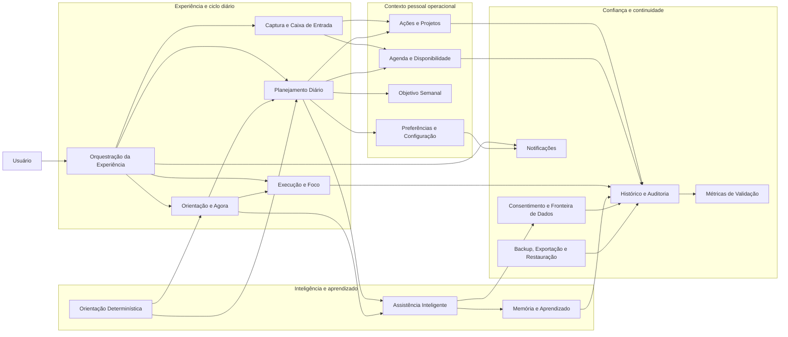
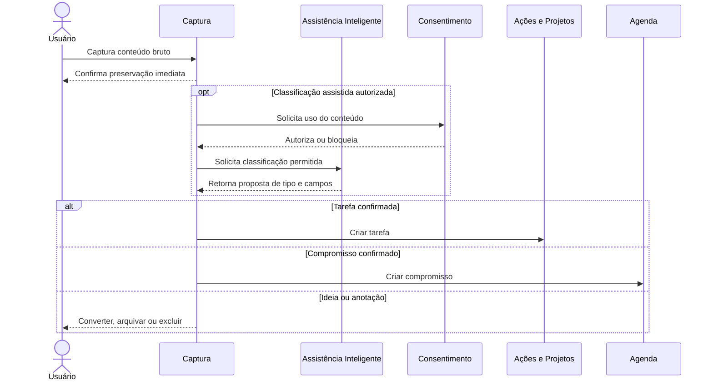
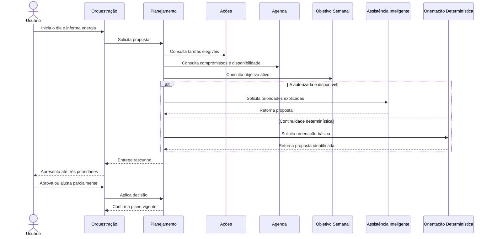
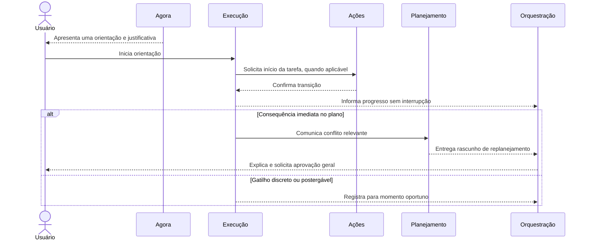
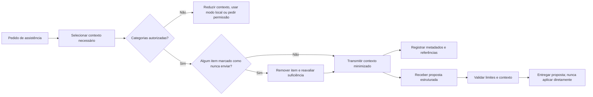

# Arquitetura Conceitual — Second Brain OS

**Status:** Proposta para validação  
**Base normativa:** PRD 1.2 congelado  
**Escopo:** domínios, responsabilidades, limites, dependências e comunicação  
**Fora de escopo:** tecnologias, frameworks, banco de dados, infraestrutura física e implementação

## 1. Objetivo

Esta arquitetura organiza o Second Brain OS em domínios conceituais coesos. Cada domínio possui uma responsabilidade de produto, é dono de informações específicas e expõe capacidades explícitas aos demais.

A arquitetura busca preservar quatro propriedades do PRD:

1. o ciclo diário funciona mesmo sem modelo de IA;
2. a IA externa melhora a experiência, mas não se torna dona dos dados ou das decisões;
3. nenhuma transmissão externa contorna consentimento;
4. planejamento, recomendação e aplicação de mudanças permanecem separados.

## 2. Princípios arquiteturais conceituais

### AC-01 — O ciclo diário é o eixo do sistema

Captura, planejamento, orientação, execução, adaptação e encerramento formam o caminho principal. Domínios auxiliares existem para fortalecer esse ciclo.

### AC-02 — Cada informação possui um único domínio responsável

Outros domínios podem consultar ou manter referências, mas não alteram cópias próprias do mesmo conceito.

### AC-03 — Proposta não é decisão aplicada

Planejamentos e reorganizações sugeridos permanecem como rascunhos. A aprovação do usuário é uma operação distinta da geração da proposta.

### AC-04 — IA não é autoridade de dados

A IA recebe contexto permitido, produz propostas e explicações e devolve resultados estruturados. Ela não altera diretamente tarefas, compromissos, projetos, memórias ou permissões.

### AC-05 — O modo determinístico é uma capacidade interna completa

Ausência de modelo externo não impede captura, consulta, planejamento manual, orientação manual, foco, histórico, backup ou recuperação.

### AC-06 — Transmissão externa atravessa uma única fronteira controlada

Todo dado destinado a um serviço externo passa por verificação de consentimento, restrição por item e registro de auditoria.

### AC-07 — Comunicação expressa intenção

Os domínios se comunicam por comandos, consultas, eventos e propostas; não por alteração informal do estado pertencente a outro domínio.

### AC-08 — Evolução futura não invade o MVP

Integrações, contexto do computador, sincronização, modelos locais avançados e colaboração permanecem fora dos domínios obrigatórios do MVP.

## 3. Visão geral dos domínios

O diagrama representa dependências conceituais, não processos físicos nem escolhas de implantação.

## 4. Classificação dos domínios

### 4.1 Domínios centrais

São diretamente responsáveis pela promessa do produto:

- Planejamento Diário;
- Orientação e Agora;
- Assistência Inteligente;
- Orquestração da Experiência.

### 4.2 Domínios operacionais

Fornecem o contexto necessário ao ciclo:

- Captura e Caixa de Entrada;
- Ações e Projetos;
- Agenda e Disponibilidade;
- Objetivo Semanal;
- Execução e Foco.

### 4.3 Domínios de apoio

Protegem continuidade, confiança e avaliação:

- Preferências e Configuração;
- Memória e Aprendizado;
- Orientação Determinística;
- Consentimento e Fronteira de Dados;
- Histórico e Auditoria;
- Backup, Exportação e Restauração;
- Notificações;
- Métricas de Validação.

## 5. Domínios e limites

### 5.1 Orquestração da Experiência

**Responsabilidade:** coordenar os estados do ciclo diário e apresentar ao usuário a experiência correta para o momento.

**Controla:**

- estado anterior à aprovação do plano;
- estado posterior à aprovação;
- entrada e saída do Modo Foco;
- fluxo de encerramento;
- fluxo de retomada após ausência;
- coordenação de perguntas opcionais.

**Não controla:**

- conteúdo das tarefas;
- cálculo das prioridades;
- compromissos;
- inferências;
- permissões;
- aplicação direta de mudanças em outros domínios.

**Depende de:** Planejamento Diário, Orientação e Agora, Execução e Foco, Preferências e Configuração.

**Expõe:** iniciar dia, apresentar proposta, aprovar ou ajustar plano, iniciar foco, encerrar dia e retomar contexto.

### 5.2 Captura e Caixa de Entrada

**Responsabilidade:** impedir perda de pensamentos e preservar conteúdo bruto até sua organização.

**Controla:**

- item capturado;
- conteúdo original;
- data de captura;
- classificação pendente ou sugerida;
- estado de organização do item.

**Não controla:**

- tarefa após conversão;
- compromisso após confirmação;
- projeto;
- prioridade;
- recomendação da IA.

**Depende de:** Assistência Inteligente apenas para classificação opcional; Consentimento quando a classificação usar serviço externo.

**Comunica:** solicita criação de tarefa ou compromisso ao domínio responsável; arquiva ou exclui ideias e anotações; mantém o original quando a interpretação falha.

### 5.3 Ações e Projetos

**Responsabilidade:** administrar tarefas e o contexto mínimo de projetos.

**Controla:**

- tarefa e seu ciclo de vida;
- prazo;
- data desejada;
- duração estimada e real consolidada;
- categoria de saúde, manutenção ou descanso;
- vínculo com objetivo semanal;
- projeto mínimo;
- vínculo entre tarefa e projeto.

**Não controla:**

- posição da tarefa no plano diário;
- orientação Agora;
- sessão de execução;
- compromisso;
- inferência comportamental.

**Depende de:** Histórico e Auditoria para registrar transições; Objetivo Semanal e Agenda apenas como referências válidas.

**Expõe:** criar, editar, planejar, iniciar, concluir, adiar e cancelar tarefa; criar, arquivar e consultar projeto mínimo.

### 5.4 Agenda e Disponibilidade

**Responsabilidade:** representar restrições fixas de tempo e calcular janelas disponíveis.

**Controla:**

- compromisso;
- série semanal recorrente;
- exceção de uma ocorrência;
- janela padrão de disponibilidade por dia;
- exceção de disponibilidade por data;
- intenção temporal original do compromisso.

**Não controla:**

- ordem flexível das tarefas;
- prioridade;
- objetivo semanal;
- replanejamento do conjunto.

**Depende de:** Preferências e Configuração para fuso e transição do dia; Histórico e Auditoria para mudanças relevantes.

**Expõe:** criar ou alterar compromisso, consultar conflitos, consultar próxima restrição e calcular tempo livre.

### 5.5 Objetivo Semanal

**Responsabilidade:** manter o principal resultado que orienta a semana.

**Controla:**

- objetivo semanal ativo;
- período de validade;
- confirmação de alteração;
- histórico de objetivos semanais.

**Não controla:**

- tarefas;
- prioridades;
- projetos;
- avaliação de desempenho.

**Depende de:** Histórico e Auditoria.

**Expõe:** definir, alterar, consultar e encerrar objetivo semanal.

### 5.6 Planejamento Diário

**Responsabilidade:** produzir e manter um plano híbrido, realista e aprovável.

**Controla:**

- plano diário;
- prioridades propostas e aprovadas;
- sequência flexível de tarefas;
- rascunho de plano;
- rascunho de replanejamento;
- estado de aprovação;
- explicação consolidada das mudanças.

**Não controla:**

- conteúdo ou estado definitivo da tarefa;
- compromissos;
- objetivo semanal;
- execução;
- permissões de dados.

**Depende de:** Ações e Projetos, Agenda e Disponibilidade, Objetivo Semanal, Preferências, Assistência Inteligente e Orientação Determinística.

**Expõe:** preparar proposta, ajustar parcialmente, aprovar, rejeitar, replanejar e consultar plano vigente.

**Regra de limite:** somente este domínio aplica uma proposta aprovada ao plano. Assistência Inteligente e Orientação Determinística apenas propõem.

### 5.7 Orientação e Agora

**Responsabilidade:** determinar e apresentar uma única orientação atual coerente com o plano e o contexto.

**Controla:**

- orientação Agora ativa;
- tipo da orientação;
- justificativa acessível;
- nível de suficiência do contexto;
- substituição manual do Agora.

**Não controla:**

- estado da tarefa;
- plano diário;
- compromisso;
- execução;
- memória.

**Depende de:** Planejamento Diário, Agenda e Disponibilidade, Ações e Projetos, Preferências, Assistência Inteligente e Orientação Determinística.

**Expõe:** obter Agora, explicar, substituir, invalidar quando o contexto muda e declarar falta de contexto.

### 5.8 Execução e Foco

**Responsabilidade:** registrar a execução da orientação atual e proteger a experiência concentrada.

**Controla:**

- sessão de execução;
- início, pausa, retomada e encerramento;
- tempo registrado;
- estado visual de foco;
- interrupção preservada.

**Não controla:**

- conclusão definitiva da tarefa sem comando correspondente;
- prioridade;
- replanejamento;
- notificações externas;
- inferências.

**Depende de:** Orientação e Agora, Ações e Projetos e Histórico e Auditoria.

**Comunica:** informa início, pausa, encerramento e excesso com consequência. O domínio Ações e Projetos confirma a transição da tarefa; Planejamento decide se um replanejamento é necessário.

### 5.9 Assistência Inteligente

**Responsabilidade:** transformar contexto autorizado em propostas, explicações, perguntas mínimas e inferências permitidas.

**Controla:**

- solicitação conceitual de assistência;
- contexto selecionado para a solicitação;
- resposta estruturada recebida;
- explicação de alto nível;
- indicação de confiança ou contexto insuficiente.

**Não controla:**

- dados pessoais de origem;
- permissões;
- aplicação de plano;
- memória confirmada;
- tarefas ou compromissos;
- envio direto a serviço externo sem a fronteira de consentimento.

**Depende de:** Consentimento e Fronteira de Dados, Memória e Aprendizado e domínios que fornecem contexto.

**Expõe:** classificar captura, propor prioridades, propor Agora, explicar plano, propor replanejamento e sugerir inferência permitida.

**Regra de limite:** a saída sempre é proposta. Uma resposta de IA nunca equivale a mutação autorizada.

### 5.10 Orientação Determinística

**Responsabilidade:** fornecer continuidade previsível quando a IA externa não está disponível ou não está autorizada.

**Controla:**

- regras locais de ordenação;
- identificação explícita da origem determinística;
- avaliação de compromisso, prazo, importância declarada e duração disponível.

**Não controla:**

- estado dos dados de origem;
- aplicação do plano;
- inferências comportamentais;
- tentativa de simular uma conversa inteligente completa.

**Depende de:** Ações e Projetos, Agenda e Disponibilidade e Objetivo Semanal.

**Expõe:** proposta básica de prioridades e Agora, sempre identificada como determinística.

### 5.11 Memória e Aprendizado

**Responsabilidade:** administrar observações, preferências aprendidas e inferências ao longo de seu ciclo de vida.

**Controla:**

- memória observada;
- inferência proposta;
- confirmação, rejeição, desatualização, arquivamento e exclusão;
- origem, atualidade e tipo da memória;
- bloqueio de inferência rejeitada.

**Não controla:**

- fatos operacionais pertencentes a outros domínios;
- objetivos;
- tarefas;
- recomendações aplicadas;
- permissões externas.

**Depende de:** Histórico e Auditoria para observações; usuário para confirmar inferências.

**Expõe:** consultar memória aplicável, propor inferência, confirmar, rejeitar, corrigir, arquivar e excluir.

### 5.12 Preferências e Configuração

**Responsabilidade:** manter escolhas explícitas sobre comportamento e experiência.

**Controla:**

- proatividade;
- estilo de comunicação;
- intensidade de notificações;
- horários silenciosos;
- inicialização com o Windows;
- horário de encerramento;
- fuso local reconhecido;
- horário de transição do dia;
- janela diária de disponibilidade como configuração fornecida à Agenda.

**Não controla:**

- consentimentos de transmissão;
- inferências;
- prioridades;
- conteúdo das notificações ocasionais.

**Depende de:** usuário e contexto local autorizado.

**Expõe:** consultar e alterar preferências.

### 5.13 Consentimento e Fronteira de Dados

**Responsabilidade:** decidir se e como um contexto pode deixar o dispositivo.

**Controla:**

- permissão por categoria;
- proibição “nunca enviar” por item;
- apresentação da primeira transmissão de uma categoria;
- preparação minimizada do conteúdo permitido;
- autorização ou bloqueio da transmissão;
- metadados da transmissão realizada.

**Não controla:**

- finalidade de negócio da recomendação;
- conteúdo original dos domínios;
- memória;
- resposta da IA;
- armazenamento do histórico de auditoria.

**Depende de:** Preferências apenas para apresentação; Histórico e Auditoria para registrar transmissões.

**Expõe:** verificar permissão, apresentar categorias, autorizar, revogar e consultar política aplicável.

### 5.14 Histórico e Auditoria

**Responsabilidade:** preservar rastreabilidade sem duplicar desnecessariamente conteúdo sensível.

**Controla:**

- eventos de mudança relevantes;
- referências a entidades afetadas;
- origem da ação;
- momento da ocorrência;
- metadados de transmissões;
- eventos de recomendação, aprovação e rejeição necessários à confiança e validação.

**Não controla:**

- estado atual das entidades;
- payload integral de transmissão por padrão;
- métricas derivadas;
- decisões de retenção pertencentes ao contrato de preferência e privacidade.

**Depende de:** eventos emitidos pelos demais domínios.

**Expõe:** consultar trilha, reconstruir contexto explicável e fornecer observações autorizadas à Memória e às Métricas.

### 5.15 Backup, Exportação e Restauração

**Responsabilidade:** proteger continuidade e portabilidade dos dados locais.

**Controla:**

- política configurada de backup;
- versões de backup;
- estado e falha de cada operação;
- validação de integridade;
- ponto de recuperação anterior à restauração;
- exportação completa.

**Não controla:**

- significado dos dados de domínio;
- exclusão dentro dos domínios;
- sincronização em nuvem;
- compartilhamento.

**Depende de:** todos os domínios proprietários de dados e Preferências; registra resultados no Histórico.

**Expõe:** criar backup, exportar, validar, restaurar e informar condição de recuperação.

### 5.16 Notificações

**Responsabilidade:** entregar intervenções externas mínimas, oportunas e configuráveis.

**Controla:**

- solicitação de notificação;
- elegibilidade por horário silencioso e preferência;
- estado de entrega e rejeição;
- prevenção de repetição indevida.

**Não controla:**

- decisão de negócio que originou o aviso;
- compromisso;
- plano;
- replanejamento;
- conteúdo completo do ciclo diário.

**Depende de:** Orquestração, Agenda, Planejamento e Preferências.

**Expõe:** solicitar, cancelar, silenciar e registrar resultado de notificação.

### 5.17 Métricas de Validação

**Responsabilidade:** medir a hipótese do MVP sem transformar a experiência em vigilância.

**Controla:**

- avaliações subjetivas solicitadas;
- definições de métricas do piloto;
- agregações derivadas;
- período de linha de base e avaliação;
- resultados comparativos.

**Não controla:**

- histórico operacional original;
- recomendações;
- metas pessoais de produtividade;
- telemetria externa implícita.

**Depende de:** Histórico e Auditoria, Orquestração e respostas voluntárias do usuário.

**Expõe:** registrar avaliação, calcular indicadores e produzir visão de validação do produto.

## 6. Mapa de propriedade da informação

| Conceito | Domínio proprietário | Consumidores principais |
|---|---|---|
| Item capturado | Captura e Caixa de Entrada | Assistência Inteligente, Ações, Agenda |
| Tarefa | Ações e Projetos | Planejamento, Agora, Execução, IA |
| Projeto mínimo | Ações e Projetos | Planejamento, IA |
| Compromisso e recorrência | Agenda e Disponibilidade | Planejamento, Agora, Notificações, IA |
| Disponibilidade calculada | Agenda e Disponibilidade | Planejamento, Agora, IA |
| Objetivo semanal | Objetivo Semanal | Planejamento, Agora, IA |
| Plano e prioridades | Planejamento Diário | Orquestração, Agora, Execução |
| Orientação Agora | Orientação e Agora | Orquestração, Execução |
| Sessão e tempo executado | Execução e Foco | Ações, Histórico, Métricas |
| Preferência explícita | Preferências e Configuração | Orquestração, Agenda, IA, Notificações |
| Memória e inferência | Memória e Aprendizado | Assistência Inteligente, usuário |
| Permissão externa | Consentimento e Fronteira de Dados | Assistência Inteligente |
| Evento auditável | Histórico e Auditoria | Memória, Métricas, explicações |
| Backup e restauração | Backup, Exportação e Restauração | Usuário, todos os proprietários de dados |
| Métrica derivada | Métricas de Validação | Usuário e avaliação do piloto |

## 7. Formas de comunicação

### 7.1 Comando

Expressa intenção de alterar estado e possui um único domínio destinatário.

Exemplos:

- “Criar tarefa a partir desta captura.”
- “Aprovar este rascunho de plano.”
- “Iniciar esta orientação.”
- “Revogar permissão para tarefas.”

Um comando pode ser aceito ou rejeitado. A rejeição deve ser explícita.

### 7.2 Consulta

Solicita informação atual sem alterar estado.

Exemplos:

- “Quais janelas estão disponíveis hoje?”
- “Qual é o objetivo semanal?”
- “Quais memórias confirmadas são aplicáveis?”

Consultas não transferem propriedade da informação.

### 7.3 Evento

Declara algo que já ocorreu e pode interessar a outros domínios.

Exemplos:

- “Tarefa iniciada.”
- “Plano aprovado.”
- “Compromisso alterado.”
- “Transmissão externa realizada.”

Eventos não solicitam alteração específica e não devem carregar conteúdo sensível desnecessário.

### 7.4 Proposta

Resultado não aplicado que exige decisão posterior.

Exemplos:

- prioridades sugeridas;
- rascunho de replanejamento;
- orientação Agora sugerida;
- inferência comportamental proposta.

Uma proposta possui origem, contexto considerado, limitações relevantes e validade temporal.

## 8. Fluxos conceituais principais

### 8.1 Captura e organização

### 8.2 Planejamento e aprovação

### 8.3 Agora, execução e adaptação

### 8.4 Fronteira de IA externa

## 9. Regras de dependência

1. Orquestração coordena fluxos, mas não se torna proprietária dos dados dos demais domínios.
2. Planejamento conhece identificadores e atributos necessários de tarefas, compromissos e objetivo; não mantém cópias autoritativas.
3. Agora depende do plano vigente, mas sua substituição manual não altera automaticamente o plano.
4. Execução registra sessões; Ações e Projetos controla o estado final da tarefa.
5. Assistência Inteligente não acessa serviços externos sem Consentimento e Fronteira de Dados.
6. Memória não reescreve fatos operacionais. Uma correção deve ser enviada ao domínio proprietário.
7. Métricas consomem eventos e avaliações; não instrumentam alterações nos domínios centrais.
8. Notificações entregam avisos, mas não decidem quando um compromisso ou replanejamento é relevante.
9. Backup coleta estados consistentes, mas não interpreta regras de negócio.
10. Histórico preserva rastreabilidade, mas não substitui o estado atual dos domínios.

## 10. Estados de consistência importantes

### 10.1 Plano em preparação

Pode receber propostas e ajustes, mas não orienta execução como plano aprovado.

### 10.2 Plano aprovado

É a referência vigente para prioridades e Agora. Mudanças estruturais posteriores geram nova versão ou rascunho de replanejamento.

### 10.3 Plano desatualizado

Ocorre quando um compromisso, tarefa ou disponibilidade invalida premissas relevantes. O plano continua visível, mas deve sinalizar que precisa de revisão.

### 10.4 Orientação válida

O Agora ainda é compatível com tempo, compromisso, estado da tarefa e plano vigente.

### 10.5 Orientação inválida

O contexto mudou ou a entidade relacionada deixou de ser executável. O sistema deve recalcular, solicitar escolha ou declarar falta de contexto.

### 10.6 Proposta expirada

Uma proposta deixa de ser aplicável quando seus dados de origem mudam materialmente. Não pode ser aplicada silenciosamente.

## 11. Limites de falha e continuidade

| Falha | Comportamento conceitual esperado |
|---|---|
| IA externa indisponível | Planejamento manual e orientação determinística continuam disponíveis |
| Permissão insuficiente | Contexto é reduzido, limitação é informada e nenhum dado proibido é enviado |
| Resposta de IA inválida | Proposta é rejeitada; estado do produto permanece inalterado |
| Captura não interpretada | Conteúdo bruto permanece na Caixa de entrada |
| Plano perde validade | É marcado como desatualizado e pode gerar rascunho de replanejamento |
| Notificação falha | O estado de negócio não é alterado; falha pode ser consultada |
| Backup falha | Falha é explícita; versão anterior válida permanece preservada |
| Restauração não passa na validação | Estado corrente não é substituído |
| Evento de métrica falha | Fluxo principal continua funcionando |
| Histórico técnico atinge retenção | Registros descartáveis obedecem política; histórico pessoal é preservado |

## 12. Extensões futuras previstas, mas não implementadas

Os seguintes pontos são portas conceituais, não domínios ativos do MVP:

- provedores de calendário poderão fornecer compromissos à Agenda, sem assumir sua propriedade conceitual;
- sinais do computador poderão fornecer observações à Memória, sempre com consentimento;
- modelos locais poderão atender ao contrato da Assistência Inteligente conforme suas capacidades;
- sincronização futura deverá respeitar a propriedade de dados já definida;
- novos módulos poderão referenciar tarefas, projetos e objetivo sem alterar seus limites.

Nenhuma dessas extensões é requisito para a arquitetura executável do MVP.

## 13. Decisões reservadas para a próxima etapa

Esta arquitetura conceitual não decide:

- organização física da aplicação;
- processos, serviços ou módulos de código;
- linguagem ou framework;
- mecanismo de persistência;
- formato físico de eventos e históricos;
- estratégia concreta de criptografia;
- protocolo de comunicação;
- fornecedor de IA;
- formato de backup;
- versões suportadas do Windows;
- modelo de implantação ou atualização.

Essas decisões deverão ser tomadas na arquitetura lógica e técnica, justificadas pelos limites e contratos definidos aqui.

## 14. Critérios de validação da arquitetura conceitual

A arquitetura conceitual é adequada quando:

1. cada requisito do MVP encontra um domínio responsável;
2. nenhuma entidade possui dois proprietários;
3. IA não pode aplicar mudanças diretamente;
4. consentimento não pode ser contornado;
5. o ciclo diário continua possível sem modelo;
6. propostas e estados aplicados permanecem distintos;
7. falhas auxiliares não derrubam o ciclo principal;
8. extensões futuras não ampliam o MVP;
9. métricas e histórico não se tornam fontes paralelas de verdade;
10. a arquitetura técnica futura pode escolher mecanismos sem reinterpretar o produto.
