# Arquitetura Lógica — Second Brain OS v1.0

**Status:** Proposta completa para aprovação  
**Fontes:** PRD 1.2 congelado; Arquitetura Conceitual 1.0  
**Escopo:** componentes, contratos, estados, fluxos, consistência e falhas do MVP  
**Exclusões:** tecnologias, implantação física, banco, linguagem, framework e fornecedor

## 1. Resumo executivo

Esta arquitetura transforma os 17 domínios conceituais aprovados em componentes lógicos colaborativos. Ela define propriedade de estado, contratos de interação, limites transacionais, fallback determinístico, fronteira de consentimento e comportamento diante de falhas.

> A arquitetura lógica define o comportamento e a colaboração dos componentes sem determinar sua implementação física.

O ciclo principal é captura → planejamento → aprovação → Agora → execução → adaptação → encerramento. A IA externa produz propostas; componentes proprietários validam e, após decisão do usuário, convertem propostas em comandos. A operação determinística mantém continuidade. Histórico, métricas e projeções nunca se tornam fontes operacionais.

## 2. Fontes normativas e precedência

1. PRD 1.2 congelado.
2. Arquitetura Conceitual 1.0.
3. Esta Arquitetura Lógica 1.0.
4. Futuras decisões técnicas e ADRs.

Inconsistência sobe para a fonte superior. Ambiguidade de implementação fica reservada à arquitetura técnica. Requisito sem contrato lógico bloqueia a aprovação deste documento. Mudança de comportamento ou escopo exige revisão formal do PRD; não pode entrar silenciosamente.

## 3. Princípios lógicos

| ID | Princípio | Motivação e consequência | Aplicação | Antipadrão proibido |
|---|---|---|---|---|
| AL-01 | Propriedade única | Evita fontes concorrentes; só o proprietário muta estado | Planejamento possui planos | Métricas corrigirem plano |
| AL-02 | Interações distintas | Intenção, leitura, fato ocorrido e sugestão têm semânticas diferentes | comando, consulta, evento, proposta | Evento usado como comando |
| AL-03 | IA sem mutação | Preserva autonomia e consistência | IA devolve proposta validável | IA concluir tarefa |
| AL-04 | Consentimento prévio | Nenhum dado sai sem autorização verificável | pacote passa pela fronteira | chamada externa direta |
| AL-05 | Continuidade determinística | Ciclo principal não depende da IA | regras locais e seleção manual | fingir análise humana |
| AL-06 | Reversibilidade | Reduz impacto de erro | rascunho antes de plano | substituir plano sem retorno |
| AL-07 | Idempotência lógica | Repetição não duplica efeitos | chave de intenção em comandos críticos | evento duplicado criar duas tarefas |
| AL-08 | Rastreabilidade mínima | Explica decisões sem duplicar dados sensíveis | correlação e causalidade | copiar payload integral no log |
| AL-09 | Falha auxiliar isolada | Métricas, notificações e histórico não derrubam o ciclo | registrar pendência ou degradar | bloquear foco por métrica |
| AL-10 | Consistência do núcleo | Plano, Agora e tarefa não divergem silenciosamente | invalidação explícita | Agora apontar cancelada |
| AL-11 | Minimização | Contexto é específico por finalidade | pacote por operação | contexto universal da vida |
| AL-12 | Epistemologia explícita | Fato, inferência e recomendação não se confundem | inferência nasce proposta | inferência persistida como fato |
| AL-13 | Métrica não operacional | Avaliação não governa o produto | leitura derivada | KPI mudar prioridade |
| AL-14 | Local por padrão | Telemetria externa não é implícita | diagnóstico local | envio silencioso |
| AL-15 | Falhas explícitas | Estado incerto é visível | backup falhou | sucesso presumido |
| AL-16 | Contratos versionáveis | Evolução preserva compatibilidade lógica | versão em eventos e propostas | mudar significado silenciosamente |

## 4. Visão lógica

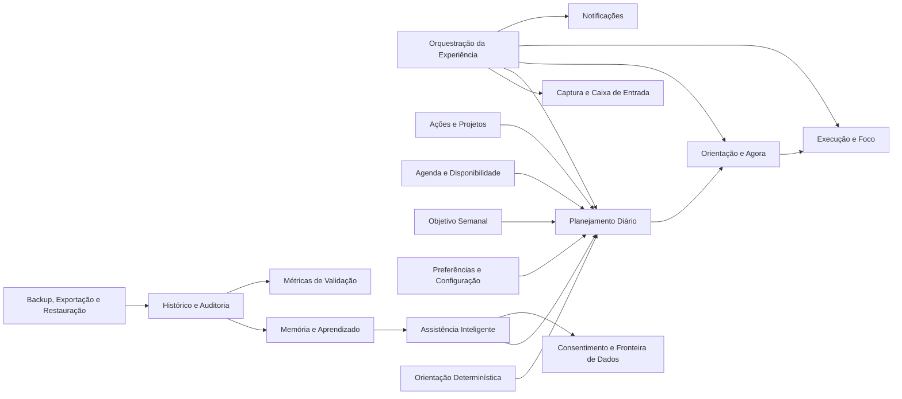

## 5. Componentes lógicos dos 17 domínios

As siglas C/E/Q/P significam comandos, eventos, consultas e propostas. Cada linha descreve estado próprio, dependências, invariantes e degradação.

### 5.1 Orquestração da Experiência

| Componente | Responsabilidade; entradas/saídas | Estado e contratos | Dependências, invariantes e falhas |
|---|---|---|---|
| Coordenador do Ciclo Diário | Conduz início, pré-aprovação, pós-aprovação, encerramento e retomada | Estado de experiência; C iniciar/encerrar; Q estado; E ciclo iniciado/encerrado | Pode chamar Planejamento/Agora/Foco; não muta seus estados; degrada para fluxo manual |
| Coordenador de Onboarding | Coleta contexto mínimo progressivamente | progresso e pendências; C registrar etapa; Q contexto mínimo | Consulta domínios proprietários; nunca exige vida completa; preserva progresso em falha |
| Apresentador de Decisões | Entrega propostas e captura decisão total/parcial | decisão transitória; C aceitar/ajustar/rejeitar | Não aplica mudanças; encaminha comandos ao proprietário |

### 5.2 Captura e Caixa de Entrada

| Componente | Responsabilidade | Estado/contratos | Limites e degradação |
|---|---|---|---|
| Receptor de Captura | Preserva texto imediatamente | item bruto; C capturar; Q obter item; E item capturado | Não classifica como verdade; falha de interpretação mantém recebido |
| Coordenador de Interpretação | Solicita/valida P-IA-001 | proposta e confirmação; C confirmar tipo | Depende de IA/Consentimento opcionalmente; fallback manual |
| Organizador da Caixa | Arquiva, exclui ou converte | estado do item; C arquivar/excluir/converter; E item convertido | Conversão atômica com destino; não possui tarefa criada |

### 5.3 Ações e Projetos

| Componente | Responsabilidade | Estado/contratos | Limites e degradação |
|---|---|---|---|
| Gestor de Tarefas | Ciclo de vida e campos da tarefa | tarefa; C criar/editar/planejar/iniciar/concluir/adiar/cancelar; Q tarefas; E mudanças relevantes | Única fonte da tarefa; preserva duração; rejeita transição inválida |
| Gestor de Projetos Mínimos | Nome, descrição, ativo/arquivado e vínculos | projeto; C criar/editar/arquivar/vincular; Q projetos; E projeto arquivado | Sem Kanban/documentos; indisponível não impede tarefa sem projeto |

### 5.4 Agenda e Disponibilidade

| Componente | Responsabilidade | Estado/contratos | Limites e degradação |
|---|---|---|---|
| Gestor de Compromissos | Compromissos fixos e intenção temporal | compromisso; C criar/alterar/remover; Q período; E compromisso modificado | Não desloca por proposta; conflito exige confirmação |
| Gestor de Recorrência Semanal | Série semanal e exceção | série/exceções; C alterar ocorrência/série; Q ocorrências | Apenas semanal; alteração ambígua é rejeitada |
| Calculador de Disponibilidade | Janela diária menos compromissos/exceções | disponibilidade derivada; Q janelas/conflitos; E disponibilidade alterada quando relevante | Não agenda tarefa; falha retorna contexto incompleto |

### 5.5 Objetivo Semanal

| Componente | Responsabilidade | Estado/contratos | Limites e degradação |
|---|---|---|---|
| Gestor de Objetivo | Mantém no máximo um objetivo ativo | objetivo e histórico; C definir/alterar/encerrar; Q ativo; E objetivo alterado | Alteração exige confirmação; ausência não bloqueia plano |

### 5.6 Planejamento Diário

| Componente | Responsabilidade | Estado/contratos | Limites e degradação |
|---|---|---|---|
| Construtor de Contexto de Plano | Solicita contexto específico ao Context Engine | referência do contexto; Q contexto | Não possui dados originais; ausência é marcada |
| Validador de Elegibilidade | Confere estado, duração, janelas e conflitos | validação transitória; Q elegibilidade | Restrições temporais são inegociáveis |
| Coordenador de Propostas | Escolhe IA consentida ou motor determinístico | P prioridades/plano; E proposta pronta somente se outro domínio reagir | Não aplica proposta; fallback local |
| Gestor de Rascunhos | Mantém construção, edição parcial e expiração | rascunho/versionamento; C ajustar/rejeitar; Q rascunho | Um rascunho não substitui aprovado |
| Aprovador de Plano | Converte decisão em plano vigente | plano/prioridades; C aprovar/aplicar replanejamento; E plano aprovado/substituído | Um ativo por dia; idempotente |
| Detector de Invalidação | Avalia eventos que quebram premissas | marca de validade; consome mudanças relevantes; E plano desatualizado | Não replaneja sozinho |
| Coordenador de Replanejamento | Classifica gatilho e prepara rascunho | gatilho/urgência; P replanejamento | Não interrompe foco por gatilho discreto/postergável |

### 5.7 Orientação e Agora

| Componente | Responsabilidade | Estado/contratos | Limites e degradação |
|---|---|---|---|
| Seletor de Agora | Produz/valida única orientação | P Agora; Q candidatos | Não altera plano/tarefa; fallback manual/determinístico |
| Gestor da Orientação | Ativa, substitui, conclui, interrompe, expira ou invalida | Agora; C ativar/substituir/finalizar; Q atual; E Agora alterado | Nunca aponta silenciosamente para entidade inválida |
| Explicador de Agora | Expõe fatores e limitações | explicação transitória; Q explicar | Não inventa contexto ausente |

### 5.8 Execução e Foco

| Componente | Responsabilidade | Estado/contratos | Limites e degradação |
|---|---|---|---|
| Gestor de Sessão de Foco | Ciclo pronta/ativa/pausada/concluída/interrompida | sessão; C iniciar/pausar/retomar/encerrar/abandonar; E foco iniciado/encerrado | Não conclui tarefa implicitamente |
| Controlador Lógico de Tempo | Calcula duração sem definir mecanismo físico | marcos temporais e duração; Q tempo; E duração relevante | Suspensão é reconciliada; cronômetro opcional |
| Recuperador de Sessão | Reconstrói estado após encerramento inesperado | marcador recuperável; C recuperar/descartar | Falha não perde tempo já consolidado |

### 5.9 Assistência Inteligente

| Componente | Responsabilidade | Estado/contratos | Limites e degradação |
|---|---|---|---|
| Context Engine | Monta contexto específico, com origem/atualidade/suficiência | pacote local transitório; Q aos domínios; P contexto | Não possui dados; nunca cria contexto universal |
| Coordenador de Solicitação | Define finalidade, categorias e solicita fronteira | solicitação/correlação; C solicitar assistência | Nunca chama serviço contornando consentimento |
| Validador de Resposta | Valida estrutura, restrições e expiração | resultado validado/rejeitado; P validada | Texto livre não vira comando; erro aciona fallback |
| Gerador de Explicação/Pergunta | Produz explicação ou pergunta mínima permitida | proposta transitória | Não persiste fato nem pressiona usuário |

### 5.10 Orientação Determinística

| Componente | Responsabilidade | Estado/contratos | Limites e degradação |
|---|---|---|---|
| Decision Engine | Ordena por restrições aprovadas | regras versionadas; P prioridades/Agora | Sem inferência profunda; sempre identificado |
| Validador de Restrições | Conflito, duração, compromisso iminente | resultado transitório; Q validação | IA nunca supera restrição fixa |
| Explicador Determinístico | Lista regras aplicadas e lacunas | explicação | Não simula personalidade humana |

### 5.11 Memória e Aprendizado

| Componente | Responsabilidade | Estado/contratos | Limites e degradação |
|---|---|---|---|
| Gestor de Memória | Fatos, preferências e ciclo de inferência | memória; C propor/confirmar/rejeitar/arquivar/excluir; Q aplicáveis; E inferência confirmada/rejeitada | Inferência não é fato; rejeitada bloqueada |
| Observador de Padrões Permitidos | Agrega apenas padrões permitidos | observações derivadas; P inferência | Não infere categorias sensíveis; pode ficar indisponível |

### 5.12 Preferências e Configuração

| Componente | Responsabilidade | Estado/contratos | Limites e degradação |
|---|---|---|---|
| Gestor de Preferências | Comportamento, proatividade, fuso e transição do dia | configurações; C alterar; Q consultar; E configuração alterada somente quando consumidores reagem | Não guarda consentimento |
| Gestor de Atenção | Silêncio, intensidade, adiamento e supressão | orçamento de atenção; C configurar; Q elegibilidade | Nunca cria notificações |

### 5.13 Consentimento e Fronteira de Dados

| Componente | Responsabilidade | Estado/contratos | Limites e degradação |
|---|---|---|---|
| Gestor de Permissões | Permissão persistente por categoria | permissão; C conceder/revogar; Q verificar; E permissão revogada | Nova categoria nunca herdada |
| Gestor Nunca Enviar | Bloqueio por item | marcação; C marcar/desmarcar; Q verificar | Prevalece sobre permissão de categoria |
| Preparador de Pacote Autorizado | Minimiza, remove bloqueados, marca ausências | pacote transitório | Não possui originais; bloqueia pacote insuficiente |
| Coordenador de Transmissão | Autoriza, permite cancelamento, envia e registra resultado lógico | transmissão; C autorizar/cancelar; E transmissão registrada/falhou | Sem transmissão em segundo plano não autorizada |

### 5.14 Histórico e Auditoria

| Componente | Responsabilidade | Estado/contratos | Limites e degradação |
|---|---|---|---|
| Registrador de Histórico Pessoal | Eventos relevantes à trajetória | registros; Q histórico | Não altera origem; degrada sem bloquear núcleo |
| Registrador de Decisões | Propostas, aprovações e rejeições | auditoria; Q decisão | Não guarda payload sensível integral |
| Registro de Transmissões | Serviço, finalidade, categorias, referências e resultado | metadados; Q transmissões | Não duplica conteúdo por padrão |
| Diagnóstico Local | Falhas técnicas locais e retenção própria | diagnóstico; Q estado | Nunca vira telemetria externa automática |

### 5.15 Backup, Exportação e Restauração

| Componente | Responsabilidade | Estado/contratos | Limites e degradação |
|---|---|---|---|
| Coordenador de Backup | Configuração, execução, versões, verificação | operação/versões; C configurar/executar/cancelar; E backup verificado/falhou | Não declara sucesso sem verificar |
| Coordenador de Exportação | Exportação completa confirmada | operação; C exportar | Não altera domínios |
| Coordenador de Restauração | Valida, cria ponto, substitui ou reverte | restauração; C preparar/aplicar/reverter; E restauração concluída/falhou | Não substitui estado antes da validação |

### 5.16 Notificações

| Componente | Responsabilidade | Estado/contratos | Limites e degradação |
|---|---|---|---|
| Avaliador de Elegibilidade | Aplica orçamento, foco, silêncio e duplicidade | decisão transitória; Q elegibilidade | Não decide relevância de negócio |
| Entregador de Notificação | Agenda/cancela/entrega casos permitidos | notificação; C solicitar/cancelar; E entregue/falhou quando necessário | Falha não altera negócio |

### 5.17 Métricas de Validação

| Componente | Responsabilidade | Estado/contratos | Limites e degradação |
|---|---|---|---|
| Coletor de Avaliação Voluntária | Carga mental, clareza, confiança | respostas; C registrar; Q consultar | Ignorar não bloqueia fluxo |
| Derivador de Métricas | Calcula indicadores do piloto | métricas derivadas; Q indicadores | Não muda prioridade/plano |
| Gestor do Período de Validação | Linha de base e quatro semanas | período; C iniciar/encerrar | Sem meta automática antes da linha de base |

## 6. Modelo formal de interação

### 6.1 Envelope conceitual neutro

```text
interacao:
  id: identificador único
  tipo: comando | consulta | evento | proposta
  nome: nome versionado
  versao: número lógico
  emissor: ator ou componente
  alvo: domínio proprietário ou consumidores
  correlacao: jornada relacionada
  causalidade: interação que originou esta
  ocorrido_em: instante lógico
  dados: conteúdo mínimo específico
  sensibilidade: categorias envolvidas
```

Comandos críticos carregam uma chave de idempotência. Consultas não mutam. Eventos descrevem passado e só existem quando outro domínio reage, auditoria é necessária ou há relevância de consistência. Propostas expiram e não têm autoridade.

### 6.2 Payloads centrais

```text
CMD-PLN-003 AprovarPlano:
  plano_rascunho_id
  versao_esperada
  decisao: aceitar_tudo | aceitar_parcial
  prioridades_aceitas[]
  substituicoes[]
  removidas[]
  chave_idempotencia
```

```text
EVT-PLN-001 PlanoAprovado:
  plano_id
  dia_operacional
  versao
  prioridades[]
  rascunho_origem_id
  decisao_usuario_id
```

```text
QRY-CAL-002 ConsultarDisponibilidade:
  periodo
  fuso_de_referencia
resultado:
  janelas[]
  compromissos_restritivos[]
  categorias_ausentes[]
  atualidade
```

```text
PROP-AI-002 PropostaDePrioridades:
  proposta_id
  contexto_id
  gerada_por: ia_externa | deterministico
  prioridades[]: {referencia, posicao, justificativa}
  fatos_considerados[]
  inferencias_consideradas[]
  categorias_utilizadas[]
  categorias_indisponiveis[]
  confianca: baixa | media | alta
  valida_ate
  restricoes_validadas[]
```

## 7. Catálogo de comandos

Todos exigem emissor autorizado, versão esperada quando alteram estado existente e erro explícito. “Evento” vazio significa que a alteração é interna e não atende aos critérios para publicação.

| ID / Nome | Emissor → proprietário | Pré-condições e payload conceitual | Efeito / evento / desfazer | PRD |
|---|---|---|---|---|
| CMD-CAP-001 CapturarItem | usuário → Captura | conteúdo, instante, idempotência | cria recebido / EVT-CAP-001 / excluir | CAP-01..03 |
| CMD-CAP-002 ConfirmarInterpretação | usuário → Captura | item, tipo, campos, versão | classifica / — / corrigir | CAP-04..06 |
| CMD-CAP-003 ConverterItem | usuário → Captura | item, destino, campos | cria destino e marca convertido / EVT-CAP-002 / compensar | CAP-05..06 |
| CMD-CAP-004 ArquivarOuExcluirItem | usuário → Captura | item, ação | arquiva/exclui / — / desfazer quando possível | CAP-06 |
| CMD-TSK-001 CriarTarefa | Captura/usuário → Ações | título e campos opcionais | cria tarefa / EVT-TSK-001 / cancelar | CAP, PLN |
| CMD-TSK-002 EditarTarefa | usuário → Ações | tarefa, patch permitido, versão | atualiza / EVT-TSK-002 se afeta consumidores / desfazer | PLN-05 |
| CMD-TSK-003 TransicionarTarefa | usuário/Execução → Ações | tarefa, origem, destino, motivo opcional | muda estado / EVT-TSK-003 / conforme transição | EXE, END |
| CMD-PRJ-001 ManterProjeto | usuário → Ações | ação, nome, descrição, estado | cria/edita/arquiva / EVT-PRJ-001 quando arquiva | ACC-17 |
| CMD-CAL-001 CriarCompromisso | usuário/Captura → Agenda | título, início, fim, confirmação | cria / EVT-CAL-001 / remover | PLN-07 |
| CMD-CAL-002 AlterarCompromisso | usuário → Agenda | compromisso, alteração, versão | altera / EVT-CAL-002 / desfazer | RPL |
| CMD-CAL-003 ManterRecorrência | usuário → Agenda | série, dias, escopo ocorrência|série | altera / EVT-CAL-003 / desfazer | ACC-19 |
| CMD-CAL-004 ConfigurarDisponibilidade | usuário → Agenda | janelas/exceções | atualiza / EVT-CAL-004 / desfazer | PLN-09 |
| CMD-OBJ-001 DefinirObjetivoSemanal | usuário → Objetivo | texto, período, confirmação | ativa/substitui / EVT-OBJ-001 / restaurar anterior | ONB, DAY |
| CMD-PLN-001 CriarRascunhoPlano | Orquestração → Planejamento | dia, contexto, origem | cria construção / — / descartar | PLN-01..03 |
| CMD-PLN-002 EditarRascunho | usuário → Planejamento | rascunho, substituições, removidas | parcialmente editado / — / desfazer | PLN-04,08 |
| CMD-PLN-003 AprovarPlano | usuário → Planejamento | payload central acima | ativa plano / EVT-PLN-001 / novo replanejamento | PLN-04 |
| CMD-PLN-004 RejeitarRascunho | usuário → Planejamento | rascunho, feedback opcional | rejeita / EVT-FDB-001 se feedback útil | RPL-05 |
| CMD-PLN-005 SolicitarReplanejamento | usuário/Orquestração → Planejamento | plano, gatilho, urgência | cria rascunho / EVT-RPL-001 quando pendente | RPL-01..06 |
| CMD-PLN-006 AplicarReplanejamento | usuário → Planejamento | rascunho, plano base, versão | substitui atomicamente / EVT-PLN-002 / reverter | RPL |
| CMD-NOW-001 AtivarAgora | Orquestração/usuário → Agora | proposta válida ou seleção manual | ativa / EVT-NOW-001 / substituir | NOW-01..05 |
| CMD-NOW-002 SubstituirAgora | usuário → Agora | atual, nova orientação, motivo opcional | substitui / EVT-NOW-002 / restaurar se válida | NOW-04 |
| CMD-NOW-003 FinalizarAgora | Execução/usuário → Agora | orientação, resultado | conclui/interrompe/invalida / EVT-NOW-003 | EXE |
| CMD-EXE-001 IniciarFoco | usuário → Execução | Agora válido, cronômetro opcional | ativa sessão / EVT-EXE-001 / encerrar | EXE-01..04 |
| CMD-EXE-002 ControlarFoco | usuário → Execução | sessão, pausar|retomar|interromper | muda sessão / — ou EVT-EXE-002 no encerramento | EXE-03..05 |
| CMD-MEM-001 DecidirInferência | usuário → Memória | inferência, confirmar|rejeitar|corrigir | muda estado / EVT-MEM-001 / corrigir | MEM-01..05 |
| CMD-MEM-002 ArquivarOuExcluirMemória | usuário → Memória | memória, ação, confirmação | arquiva/exclui / EVT-MEM-002 se consumidores reagem | MEM-02,07 |
| CMD-CNS-001 ConcederPermissão | usuário → Consentimento | categoria, finalidade/operações | ativa permissão / EVT-CNS-001 | CNS-01..04 |
| CMD-CNS-002 RevogarPermissão | usuário → Consentimento | permissão, confirmação | bloqueia futuros envios / EVT-CNS-002 / conceder novamente | CNS-01,06 |
| CMD-CNS-003 MarcarNuncaEnviar | usuário → Consentimento | item, marcado | atualiza bloqueio / EVT-CNS-003 | CNS-08 |
| CMD-CNS-004 AutorizarTransmissão | usuário/fronteira → Consentimento | solicitação, pacote, permissão | envia/cancela / EVT-CNS-004 ou 005 | CNS-04..09 |
| CMD-PRF-001 AlterarPreferências | usuário → Preferências | alterações, versão | atualiza / EVT-PRF-001 quando reação externa | DAY, NOT |
| CMD-NOT-001 SolicitarNotificação | domínio autorizado → Notificações | caso permitido, momento, correlação | agenda/suprime / EVT-NOT-001 só se auditoria necessária | NOT-01..07 |
| CMD-BKP-001 ConfigurarBackup | usuário → Backup | destino lógico, frequência, retenção | configura / — / alterar | BKP-01..04 |
| CMD-BKP-002 ExecutarBackup | usuário/agendamento autorizado → Backup | configuração, idempotência | verifica versão / EVT-BKP-001 ou 002 | BKP-05..12 |
| CMD-BKP-003 ExportarDados | usuário → Backup | confirmação, destino lógico | exporta / EVT-BKP-003 | PRV-05,12 |
| CMD-BKP-004 RestaurarBackup | usuário → Backup | versão, confirmação, ponto recuperação | substitui ou reverte / EVT-BKP-004 ou 005 | BKP-05,10 |
| CMD-MET-001 RegistrarAvaliação | usuário → Métricas | tipo, valor, período | registra / — / corrigir/excluir | MET-01..15 |

## 8. Catálogo de consultas

| ID / Nome | Consumidor → proprietário | Parâmetros e retorno | Incompletude, consistência e minimização |
|---|---|---|---|
| QRY-CAP-001 ObterCaixa | Orquestração → Captura | estado/filtro → itens mínimos | pode atrasar visualmente; sem mutação |
| QRY-TSK-001 ObterTarefasElegíveis | Planejamento → Ações | dia/estados → tarefas, duração, prazo | marca duração ausente; estado atual exigido |
| QRY-TSK-002 ObterTarefa | Agora/Execução → Ações | id → tarefa atual | ausência invalida referência |
| QRY-PRJ-001 ObterProjetosAtivos | Planejamento/IA → Ações | nenhum → projetos mínimos | descrição só se finalidade exigir |
| QRY-CAL-001 ObterCompromissos | Planejamento/Agora → Agenda | período → ocorrências | intenção temporal preservada |
| QRY-CAL-002 ConsultarDisponibilidade | Planejamento → Agenda | payload exemplo → janelas | incompletude bloqueia encaixe confiante |
| QRY-OBJ-001 ObterObjetivoAtivo | Planejamento/IA → Objetivo | dia → objetivo ou ausência | ausência é válida |
| QRY-PLN-001 ObterPlanoAtivo | Agora/Orquestração → Planejamento | dia → plano, validade, versão | somente aprovado/ativo é vigente |
| QRY-PLN-002 ObterRascunho | Orquestração → Planejamento | id → proposta e expiração | não apresentado como plano |
| QRY-NOW-001 ConsultarAgora | Orquestração/Execução → Agora | dia → orientação/validade | inválido não é executável |
| QRY-EXE-001 ObterSessãoAtiva | Orquestração → Execução | nenhum → sessão/recuperação | no máximo uma ativa |
| QRY-MEM-001 ObterMemóriasAplicáveis | Context Engine → Memória | finalidade/período → fatos/preferências/inferências confirmadas | propostas/rejeitadas excluídas |
| QRY-PRF-001 ObterPreferências | consumidores → Preferências | chaves necessárias → valores | somente mínimo necessário |
| QRY-CNS-001 ConsultarPermissão | Fronteira → Consentimento | operação/categoria/item → decisão | “nunca enviar” prevalece |
| QRY-AUD-001 ConsultarHistórico | usuário/Memória/Métricas → Histórico | finalidade/período → registros minimizados | não é fonte operacional |
| QRY-BKP-001 ObterEstadoBackup | Orquestração → Backup | nenhum → última versão/falhas | estado verificado distinguido |
| QRY-MET-001 ObterIndicadores | usuário → Métricas | período → métricas derivadas | tolera atraso; não governa plano |
| QRY-NOT-001 ConsultarElegibilidade | Notificações → Preferências | caso/momento/contexto → permitido/suprimido | sem criar notificação |

## 9. Catálogo de eventos

Eventos carregam `id`, `versao`, `correlacao`, `causalidade`, `ocorrido_em`, referência e mudança mínima. Consumidores deduplicam por id; ordenação só é exigida por entidade/versão. Reprocessamento não pode repetir mutações. Retenção: P=pessoal, A=auditoria configurável, T=técnica curta.

| ID / Evento | Emissor → consumidores | Conteúdo mínimo / causa | Criticidade; retenção; sensibilidade; reprocessamento |
|---|---|---|---|
| EVT-CAP-001 ItemCapturado | Captura → Histórico | item, tipo bruto / captura | média; P; pessoal; sim |
| EVT-CAP-002 ItemConvertido | Captura → Histórico | item, destino / conversão atômica | alta; P; pessoal; sim |
| EVT-TSK-001 TarefaCriada | Ações → Planejamento, Histórico | tarefa, estado / criação | alta; P; pessoal; sim |
| EVT-TSK-002 TarefaRelevanteModificada | Ações → Planejamento, Agora, Histórico | tarefa, campos afetados, versão | alta; P; pessoal; sim |
| EVT-TSK-003 EstadoTarefaAlterado | Ações → Planejamento, Agora, Histórico, Métricas | tarefa, de/para, duração | alta; P; pessoal; sim |
| EVT-PRJ-001 ProjetoArquivado | Ações → Planejamento, Histórico | projeto / arquivamento | média; P; pessoal; sim |
| EVT-CAL-001 CompromissoCriado | Agenda → Planejamento, Agora, Notificações, Histórico | compromisso, período | alta; P; pessoal; sim |
| EVT-CAL-002 CompromissoModificado | Agenda → Planejamento, Agora, Notificações, Histórico | compromisso, versão, escopo | alta; P; pessoal; sim |
| EVT-CAL-003 RecorrênciaModificada | Agenda → Planejamento, Histórico | série, ocorrência/série | alta; P; pessoal; sim |
| EVT-CAL-004 DisponibilidadeAlterada | Agenda → Planejamento, Histórico | data/janelas | alta; P; pessoal; sim |
| EVT-OBJ-001 ObjetivoSemanalAlterado | Objetivo → Planejamento, Agora, Histórico | objetivo anterior/novo | alta; P; pessoal; sim |
| EVT-PLN-001 PlanoAprovado | Planejamento → Orquestração, Agora, Histórico, Métricas | payload exemplo | crítica; P; pessoal; sim |
| EVT-PLN-002 PlanoSubstituído | Planejamento → Orquestração, Agora, Histórico | anterior/novo | crítica; P; pessoal; sim |
| EVT-PLN-003 PlanoDesatualizado | Planejamento → Orquestração, Agora | plano, causas | crítica; A; pessoal; sim |
| EVT-RPL-001 ReplanejamentoPendente | Planejamento → Orquestração | plano, urgência, causa | alta; A; pessoal; sim |
| EVT-NOW-001 AgoraAtivado | Agora → Orquestração, Execução, Histórico | orientação, validade | alta; P; pessoal; sim |
| EVT-NOW-002 AgoraSubstituído | Agora → Execução, Histórico | anterior/novo | alta; P; pessoal; sim |
| EVT-NOW-003 AgoraFinalizado | Agora → Orquestração, Histórico | orientação, resultado | média; P; pessoal; sim |
| EVT-EXE-001 FocoIniciado | Execução → Histórico, Métricas | sessão, orientação | média; P; pessoal; sim |
| EVT-EXE-002 FocoEncerrado | Execução → Ações, Planejamento, Histórico, Métricas | sessão, duração, resultado | alta; P; pessoal; sim |
| EVT-MEM-001 InferênciaDecidida | Memória → Histórico, IA | inferência, decisão | média; P; sensível; sim |
| EVT-CNS-002 PermissãoRevogada | Consentimento → IA, Histórico | categoria/operações | crítica; A; sensível; sim |
| EVT-CNS-003 ItemBloqueadoParaEnvio | Consentimento → IA, Histórico | referência | crítica; A; sensível; sim |
| EVT-CNS-004 TransmissãoRegistrada | Consentimento → Histórico | serviço/finalidade/categorias/referências/resultado | crítica; A; sensível; sim |
| EVT-CNS-005 TransmissãoFalhou | Consentimento → solicitante, Histórico | operação/erro sem payload | alta; A; técnica; sim |
| EVT-PRF-001 ConfiguraçãoRelevanteAlterada | Preferências → consumidores afetados, Histórico | chaves alteradas | média; P; pessoal; sim |
| EVT-NOT-001 NotificaçãoFalhou | Notificações → Diagnóstico | referência/erro | baixa; T; técnica; sim |
| EVT-BKP-001 BackupVerificado | Backup → Histórico, Orquestração | versão/instante/destino ref. | alta; P; sensível; sim |
| EVT-BKP-002 BackupFalhou | Backup → Orquestração, Diagnóstico | operação/erro | alta; T; técnica; sim |
| EVT-BKP-003 ExportaçãoConcluída | Backup → Histórico | operação/destino ref. | alta; P; sensível; sim |
| EVT-BKP-004 RestauraçãoConcluída | Backup → todos proprietários, Histórico | versão restaurada/ponto | crítica; P; sensível; controlado |
| EVT-BKP-005 RestauraçãoFalhou | Backup → Orquestração, Diagnóstico | etapa/erro/reversão | crítica; T; técnica; sim |
| EVT-FDB-001 FeedbackRecomendaçãoRegistrado | Histórico → Memória, Métricas | recomendação/tipo | média; P; pessoal; sim |

Eventos de energia, encerramento e avaliação são registrados como fatos pelo proprietário correspondente somente quando alimentam replanejamento, memória, auditoria ou métricas; mudanças transitórias puramente visuais não publicam eventos.

## 10. Catálogo de propostas

Toda proposta possui id, versão, origem, contexto, categorias usadas/ausentes, confiança, justificativa, validade, restrições validadas e efeitos proibidos. Resposta livre jamais é comando.

| ID / Proposta | Dados mínimos e finalidade | Validação / aprovação / efeitos permitidos | Erro e histórico |
|---|---|---|---|
| PROP-AI-001 InterpretaçãoDeCaptura | texto minimizado, tipo/campos candidatos | valida formato; usuário confirma; pode originar CMD-CAP-002 | fallback manual; decisão auditável |
| PROP-AI-002 Prioridades | tarefas, agenda, disponibilidade, objetivo, energia permitidos | máximo 3, elegibilidade e conflito; aprovação total/parcial → CMD-PLN-003 | inválida descartada; feedback |
| PROP-AI-003 Plano | prioridades e sequência flexível | restrições determinísticas; usuário aprova | expira se origem mudar |
| PROP-AI-004 Agora | candidato, tipo, justificativa | compatível com plano/tempo/estado; usuário ou política aprovada ativa | fallback determinístico/manual |
| PROP-AI-005 Replanejamento | plano base, gatilho, mudanças | preserva fixos, classifica urgência; aprovação única → CMD-PLN-006 | plano anterior permanece |
| PROP-AI-006 Inferência | observações permitidas, hipótese, confiança | proíbe sensíveis; usuário confirma/rejeita | rejeitada bloqueada |
| PROP-AI-007 PerguntaMínima | lacuna crítica, pergunta única, opções | deve mudar decisão relevante; resposta opcional | sem resposta usa fallback |
| PROP-AI-008 ResumoEncerramento | fatos do dia e pendências | não move pendência; usuário decide | fallback formulário |
| PROP-AI-009 Explicação | referência da proposta, fatores/limitações | não revela raciocínio interno nem inventa fatos | fallback explicação determinística |

## 11. Context Engine

É componente interno de Assistência Inteligente, não novo domínio nem proprietário.

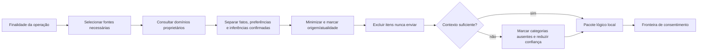

| Contexto | Fontes mínimas possíveis | Saída e suficiência |
|---|---|---|
| Planejamento | tarefas, agenda, disponibilidade, objetivo, energia | restrições + candidatos; insuficiente se agenda/disponibilidade desconhecida |
| Prioridades | elegíveis, objetivo, prazo, energia | até 3; lacunas declaradas |
| Agora | plano, próximo compromisso, tarefa atual, energia | uma orientação ou ausência consciente |
| Replanejamento | plano vigente, gatilho, mudanças, tempo restante | alternativas preservando fixos |
| Encerramento | plano, estados, pendências | resumo factual; sem movimentação automática |
| Inferência | observações permitidas e preferências | hipótese não sensível |
| Explicação | proposta e fatores usados | justificativa breve e limitações |

Contextos são transitórios, específicos, correlacionados e descartados após a finalidade, salvo metadados mínimos de auditoria.

## 12. Decision Engine determinístico

Entradas: compromissos, janelas, tarefas elegíveis, prazos, importância declarada, objetivo, energia declarada, continuidade e orientação atual. Saídas: conflitos, elegibilidade, ordenação básica, proposta de Agora e explicação de regras.

Precedência inegociável: compromisso fixo/preparação → validade e estado da tarefa → compatibilidade de duração → prazo/risco → objetivo semanal → continuidade → energia → descanso/ausência consciente. A precedência não força preencher três prioridades.

IA pode substituir a ordenação entre candidatos igualmente válidos e acrescentar contexto permitido. Não pode superar compromisso, conflito, estado inválido, item bloqueado, permissão ou duração impossível sem declarar incerteza e pedir decisão.

## 13. Máquinas de estado

### 13.1 Tarefa

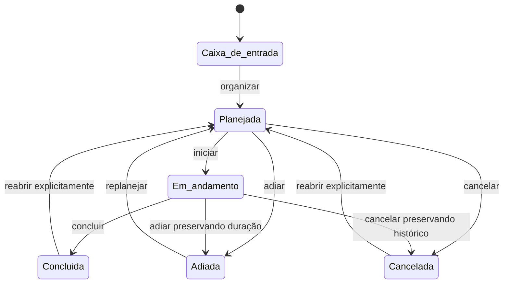

Transições silenciosas são proibidas. Conclusão encerra/invalida Agora relacionado; adiamento invalida prioridade corrente; reabertura cria nova transição auditável.

### 13.2 Demais máquinas

| Máquina | Estados | Regras essenciais |
|---|---|---|
| Item de captura | recebido, interpretação proposta, aguardando confirmação, classificado, arquivado, convertido, excluído, interpretação falhou | falha volta à organização manual; convertido não converte novamente |
| Plano diário | inexistente, em construção, rascunho, parcialmente editado, aprovado, ativo, desatualizado, replanejamento pendente, substituído, encerrado, invalidado | um ativo/dia; rascunho não substitui; mudança de origem expira proposta |
| Agora | indisponível, proposta, ativa, substituída, concluída, interrompida, expirada, invalidada | ativa exige referência válida; substituição não replaneja automaticamente |
| Sessão de foco | pronta, ativa, pausada, concluída, interrompida, abandonada, recuperável | uma ativa; cronômetro opcional; recuperação reconcilia tempo |
| Inferência | proposta, confirmada, contestada, desatualizada, arquivada, rejeitada/bloqueada, excluída | rejeitar bloqueia; arquivar preserva sem uso; excluir remove; reconsiderar exige ação explícita |
| Transmissão | solicitada, contexto preparado, consentimento pendente, autorizada, cancelada, enviada, falhou, resposta recebida, resposta inválida, registro concluído | envio só após autorizada; inválida nunca vira proposta aplicável |
| Backup/restauração | configurado, executando, verificando, verificado, falhou, corrompido, restauração preparada, ponto criado, restaurando, concluída, revertida/falhou | não restaurar sem validar e ponto seguro quando possível |

## 14. Fluxos de ponta a ponta

Cada fluxo usa os contratos catalogados. A tabela inclui caminho feliz (F), dados incompletos (D), rejeição (R) e falha auxiliar (A).

| ID / Fluxo | F | D | R | A / compensação | PRD |
|---|---|---|---|---|---|
| FLW-01 Primeiro uso | onboarding mínimo → objetivo/agenda/tarefas → proposta → plano/Agora | pergunta mínima ou manual | decidir depois preserva progresso | IA falha → determinístico | ONB-01..06 |
| FLW-02 Capturar tarefa | capturar → interpretar → confirmar → tarefa | duração vazia fica na caixa; pedida antes do plano | rejeita interpretação e edita | IA falha → classificação manual | CAP, PLN-05 |
| FLW-03 Capturar compromisso | interpretar data/hora → confirmar → criar | campo crítico ausente → pergunta | cancela sem perder texto | conflito consulta falha → não confirma automaticamente | PLN-07 |
| FLW-04 Recorrência semanal | dias → confirmar série → ocorrências | escopo ausente → solicitar ocorrência/série | mantém série | histórico falha não desfaz, marca pendência | ACC-19 |
| FLW-05 Ideia/anotação | capturar → arquivar ou converter/excluir | tipo incerto → permanece recebido | nenhuma ação | IA falha → ações manuais | CAP-06 |
| FLW-06 Plano com IA | contexto → consentimento → pacote → proposta → validar → aprovar | lacunas reduzem confiança/pergunta/fallback | parcial ou rejeição mantém rascunho/plano anterior | transmissão falha → FLW-07 | PLN, AI, CNS |
| FLW-07 Plano sem IA | contexto local → regras → proposta identificada → seleção manual | tarefa sem duração excluída ou solicitada | usuário decide depois | métrica/histórico falha não bloqueia | AI-01..03 |
| FLW-08 Aprovação parcial | substituir/remover/menos de 3 → revalidar → aprovar | substituto inválido é explicado | rejeita rascunho | auditoria falha cria pendência; plano consistente | PLN-08 |
| FLW-09 Seleção Agora | plano ativo → candidato válido → ativar | contexto insuficiente → manual/ausência | substitui sem replanejar | IA falha → determinístico | NOW |
| FLW-10 Foco | Agora → iniciar → tempo opcional → encerrar → decidir tarefa | Agora inválido bloqueia início | abandonar preserva histórico | suspensão → recuperável | EXE |
| FLW-11 Excesso sem conflito | registra excesso sem interromper | duração incerta apenas anotada | usuário ignora | métrica falha não afeta foco | RPL-06 |
| FLW-12 Excesso com conflito | detectar consequência → gatilho imediato → rascunho | agenda incompleta → alerta de incerteza | plano anterior continua quando possível | IA falha → replanejamento local/manual | RPL |
| FLW-13 Compromisso iminente | alerta elegível → preparação pode virar Agora | preparação desconhecida → mostrar compromisso | usuário ignora sem insistência | notificação falha; app ainda mostra | NOT, NOW |
| FLW-14 Energia alterada | registrar → gatilho discreto → avaliar no momento oportuno | não informada não bloqueia | ignorar sugestão | IA falha → sem adaptação automática | DAY-03, RPL |
| FLW-15 “Plano mudou” | gatilho imediato → rascunho explicado → aprovação única | pergunta mínima sobre restrição crítica | rejeita e mantém anterior | IA falha → edição manual | RPL |
| FLW-16 Rejeitar recomendação | escolher inadequada/contexto errado/não quero | feedback opcional | rejeição simples válida | memória/métrica falha não muda decisão | AI-14 |
| FLW-17 Inferência | observações permitidas → proposta → confirmar | evidência insuficiente descarta | rejeita e bloqueia | histórico falha não confirma silenciosamente | MEM |
| FLW-18 Encerramento | resumo factual → pendências → decisões → próximo dia | campos ausentes omitidos | ignorar encerra sem culpa | IA falha → formulário | END |
| FLW-19 Consentimento negado | marca categorias ausentes → reduz contexto/fallback | crítico ausente impede recomendação completa | negação respeitada | fronteira falha fechada: não envia | CNS |
| FLW-20 Nunca enviar | Context Engine seleciona → fronteira remove item → reavalia suficiência | pacote insuficiente → fallback | usuário não desmarca implicitamente | auditoria falha bloqueia envio até registro seguro | CNS-08 |
| FLW-21 Backup diário | executar → verificar → reter versões → registrar | destino indisponível → falha visível | cancelar preserva anterior | histórico falha não invalida backup verificado | BKP |
| FLW-22 Restauração | validar → confirmar → ponto → aplicar → verificar | versão incompleta/corrompida bloqueia | cancelar mantém estado | falha → reverter ao ponto | BKP |

### 14.1 Sequência crítica: plano com IA e fallback

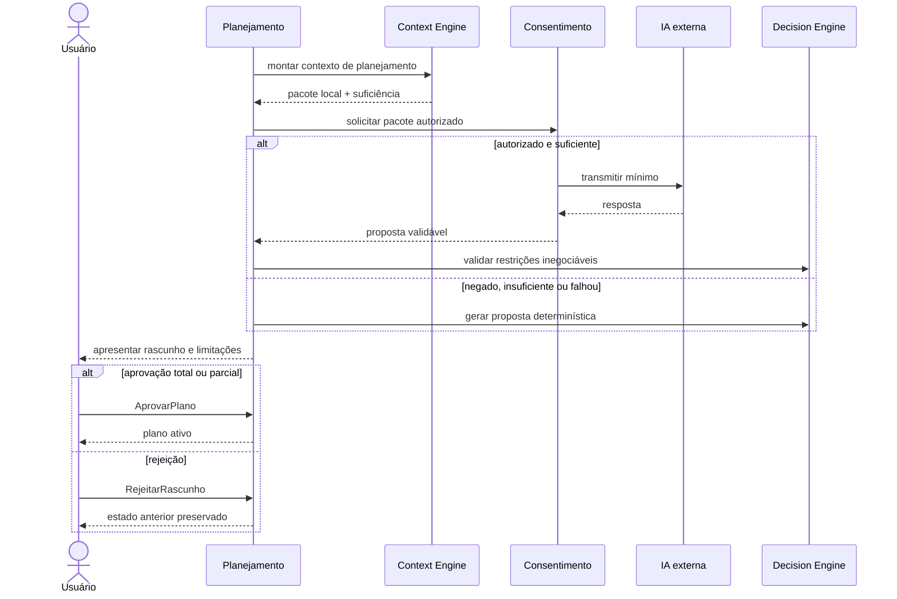

## 15. Invariantes globais

| ID | Invariante | Responsável / detecção | Reação e compensação | Severidade |
|---|---|---|---|---|
| INV-01 | Um plano ativo por dia operacional | Aprovador / versão | rejeitar duplicata; preservar vigente | crítica |
| INV-02 | Rascunho não substitui aprovado | Gestor de Rascunhos | manter anterior | crítica |
| INV-03 | Agora não aponta para elemento inválido | Gestor Agora / eventos | invalidar e selecionar/manual | crítica |
| INV-04 | Tarefa concluída não mantém foco ativo | Execução+Ações | encerrar sessão/Agora correlacionados | alta |
| INV-05 | Compromisso fixo não é deslocado sem comando | Agenda | rejeitar proposta | crítica |
| INV-06 | Plano desatualizado não parece atual | Detector | marcar e oferecer revisão | alta |
| INV-07 | Nenhuma transmissão sem autorização | Fronteira | falha fechada e auditoria | crítica |
| INV-08 | Inferência não confirmada não é fato | Memória | separar/bloquear uso factual | crítica |
| INV-09 | Histórico não muta domínio | proprietários | ignorar tentativa | alta |
| INV-10 | Backup não verificado não é recuperável | Backup | marcar falha | crítica |
| INV-11 | Proposta expirada não é aprovável | validadores | gerar nova proposta | alta |
| INV-12 | Rejeição bloqueia inferência | Memória | suprimir reapresentação | alta |
| INV-13 | Prioridade removida não retorna no mesmo rascunho | Planejamento | preservar decisão | média |
| INV-14 | Duplicidade não duplica mutação | todo proprietário | retornar resultado anterior | crítica |
| INV-15 | Restauração parcial não vira estado ativo | Restauração | reverter ponto | crítica |

## 16. Consistência temporal

- Dia operacional usa fuso local e transição configurável; mudança posterior não reescreve histórico.
- Tarefa após a meia-noite pertence ao dia operacional definido pela transição, preservando início real.
- Compromisso guarda intenção local; mudança de fuso exige apresentação do impacto antes de alterar intenção.
- Recorrência é semanal; exceção vence a série naquela ocorrência.
- Plano que cruza transição é encerrado ou marcado para revisão; não migra pendências silenciosamente.
- Agora expira quando janela, plano, entidade ou compromisso tornam a orientação inválida.
- Alteração relevante do relógio invalida cálculos temporais derivados e solicita reconciliação.
- Suspensão do computador preserva marcos; retomada reconcilia duração e compromisso iminente antes de notificar.

## 17. Replanejamento e orçamento de atenção

| Classe | Gatilhos | Intervenção | Rascunho e rejeição |
|---|---|---|---|
| Imediato | compromisso iminente, declaração do usuário, plano inviável | dentro do app; notificação apenas com consequência real | cria rascunho; aprovação única; anterior continua se possível |
| Discreto | energia, prioridade adiada, novo compromisso sem conflito imediato | próximo momento natural; não interrompe foco | pode preparar rascunho; rejeição encerra sem insistência |
| Postergável | excesso sem consequência, variação pequena, contexto incompleto | encerramento ou consulta voluntária | não exige rascunho imediato |

Notificações externas do MVP: check-in configurável, compromisso próximo, replanejamento com consequência real e convite de encerramento. Horário silencioso suprime salvo decisão explícita já aprovada; duplicadas são agrupadas; ignorar não repete; Modo Foco suprime discretas; retomada após ausência agrega contexto em uma única recepção.

## 18. Consentimento e transmissão

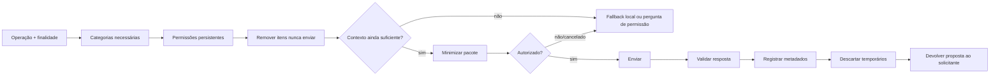

Novas categorias ou operações não herdam autorização. O registro padrão contém serviço, horário, finalidade, categorias, referências, resultado e erro, nunca payload sensível integral. Revogação bloqueia futuros envios; não promete apagar processamento externo anterior.

## 19. Histórico, memória e métricas

| Camada | Conteúdo | Retenção e exclusão | Pode alterar operação? |
|---|---|---|---|
| Histórico pessoal | marcos relevantes do usuário | preservado por padrão; controlado pelo usuário | não |
| Auditoria de decisões | proposta, aprovação, rejeição, alteração | configurável sem quebrar consistência | não |
| Transmissões | metadados e referências | conforme política de confiança | não |
| Diagnóstico técnico | falhas locais minimizadas | curta/configurável | não |
| Métricas do piloto | agregações e avaliações voluntárias | período de validação; excluíveis | não |

Memória separa fatos observáveis, inferências propostas e preferências confirmadas. Apenas padrões de planejamento/execução permitidos entram no observador. Categorias médicas, psicológicas, financeiras, identitárias, políticas, religiosas, de saúde, personalidade sensível e julgamento moral são rejeitadas antes da apresentação.

## 20. Backup, exportação e restauração

Backup: destino escolhido, padrão diário configurável, múltiplas versões, proteção equivalente, verificação obrigatória, falha visível e aviso de desatualização. Exportação: manual, completa e confirmada. Restauração: validar origem, confirmar, criar ponto de recuperação quando seguro, aplicar como operação conceitualmente atômica, verificar e reverter se falhar. Formatos e mecanismos ficam para arquitetura técnica.

## 21. Limites transacionais conceituais

| Operação que deve parecer atômica | Estados envolvidos | Compensação |
|---|---|---|
| Converter ideia em tarefa | item + nova tarefa | se tarefa falhar, item continua não convertido |
| Aprovar plano | rascunho + prioridades + plano ativo | manter plano anterior e rascunho |
| Aplicar replanejamento | plano anterior + novo | restaurar anterior |
| Concluir tarefa correlacionada | tarefa + sessão + Agora | marcar reconciliação; nunca aparentar conclusão parcial definitiva |
| Revogar permissão | permissão + transmissões futuras | bloqueio tem precedência imediata |
| Alterar recorrência | série ou exceção | reverter alteração incompleta |
| Restaurar backup | ponto + conjunto de estados | reverter ao ponto |

## 22. Projeções de leitura

| Projeção | Fontes | Atualização/tolerância | Se desatualizada |
|---|---|---|---|
| Início pré-aprovação | objetivo, agenda, rascunho, energia | atual para decisão | sinaliza e atualiza proposta |
| Início pós-aprovação | Agora, plano, agenda | Agora exige atualidade | invalida Agora |
| Agenda híbrida | agenda + plano | pequeno atraso visual tolerável | exibe marca de atualização |
| Histórico da tarefa | tarefa + histórico | pode atrasar | estado atual vem de Ações |
| Consentimento | permissões + transmissões | permissão deve ser atual | falha fechada |
| Revisão de memória | Memória | atual para decisão | impede confirmação antiga |
| Estado do backup | Backup | pode atrasar visualmente | não declara proteção recente |
| Métricas | Histórico + avaliações | atraso tolerado | mostra período de atualização |

## 23. Modos de falha

| Falha | Domínio / severidade | Detecção e fallback | Mensagem, reprocessamento e consistência |
|---|---|---|---|
| IA indisponível | Assistência / média | timeout lógico → determinístico | informar modo local; repetir sob ação |
| Proposta inválida | Assistência / alta | validador rejeita | estado intacto; fallback |
| Consentimento negado | Consentimento / normal | decisão explícita | contexto reduzido/local; não repetir |
| Contexto insuficiente | Context Engine / média | suficiência | pergunta mínima/manual |
| Falha ao salvar | proprietário / crítica | confirmação ausente | não anunciar sucesso; tentar/reconciliar |
| Evento duplicado | consumidor / alta | id+versão | ignorar efeito repetido |
| Evento fora de ordem | consumidor / alta | versão causal | aguardar/reconsultar proprietário |
| Suspensão no cronômetro | Execução / média | salto temporal | reconciliar na retomada |
| Plano desatualizado | Planejamento / alta | evento/consulta | marcar; manter anterior até decisão |
| Compromisso alterado | Agenda / alta | versão | invalidar premissas e classificar gatilho |
| Backup falhou | Backup / alta | verificação/erro | anterior preservado; aviso |
| Backup corrompido | Backup / crítica | validação | não restaurar |
| Restauração falhou | Backup / crítica | etapa incompleta | reverter ponto |
| Espaço insuficiente | Dados/Backup / alta | operação falha | preservar estado, orientar liberação |
| Relógio/fuso alterado | Preferências/Agenda / alta | mudança detectada | invalidar derivados; reconciliar |
| Encerramento inesperado | Orquestração/Execução / alta | marcador de recuperação | retomar estado confirmado |
| Notificação indisponível | Notificações / baixa | entrega falha | app mantém informação |
| Histórico indisponível | Histórico / média | registro falha | núcleo segue; pendência limitada |
| Métricas indisponíveis | Métricas / baixa | derivação falha | nenhum impacto operacional |
| Módulo auxiliar falha | apoio / variável | limite do domínio | isolar e degradar |

## 24. Rastreabilidade consolidada

| Grupo PRD | Componentes | Fluxos | Contratos principais | Critério |
|---|---|---|---|---|
| CAP-01..06 | Captura | FLW-02..05 | CMD-CAP, EVT-CAP, PROP-AI-001 | ACC-01,18 |
| ONB-01..06 | Onboarding/Orquestração | FLW-01 | CMD-OBJ/CAL/TSK/PLN | ACC-01 |
| DAY-01..06 | Orquestração/Preferências | FLW-01,06..09 | CMD-PRF/PLN/NOW | ACC-03,04,14 |
| PLN-01..09 | Planejamento/Agenda | FLW-06..08 | CMD-PLN, QRY-CAL/TSK | ACC-02,03 |
| NOW-01..05 | Agora | FLW-09,13 | CMD-NOW, EVT-NOW | ACC-04,05 |
| EXE-01..05 | Execução | FLW-10..12 | CMD-EXE/TSK, EVT-EXE | ACC-07 |
| RPL-01..06 | Planejamento | FLW-12,14,15 | CMD-PLN-005/006, EVT-RPL | ACC-06,20 |
| END/RET | Orquestração | FLW-18,01 | PROP-AI-008 | ACC-13 |
| NOT-01..07 | Notificações/Atenção | FLW-13..15 | CMD-NOT, QRY-NOT | ACC-14 |
| AI-01..15 | Assistência/Determinístico | FLW-06,07,16,19,20 | PROP-AI, Context/Decision Engine | ACC-07,08,16 |
| MEM-01..08 | Memória | FLW-16,17 | CMD-MEM, EVT-MEM, PROP-AI-006 | ACC-11 |
| CNS-01..09 | Consentimento | FLW-06,19,20 | CMD/QRY/EVT-CNS | ACC-09,10,21 |
| PRV-01..14 | Consentimento/Histórico/Backup | FLW-19..22 | CNS/BKP | ACC-09,10,12 |
| BKP-01..12 | Backup | FLW-21,22 | CMD/EVT-BKP | ACC-12 |
| LNG-01..06 | Orquestração/IA | todos conversacionais | PROP-AI-007..009 | ACC-13 |
| UX-01..08 | Orquestração/Foco | FLW-01,08..10,18 | projeções e comandos | ACC-01,05,14 |
| MET-01..15 | Métricas | todos como observação | CMD-MET, QRY-MET | ACC-15 |
| ACC-17..21 | Ações/Agenda/Replanejamento/Consentimento | FLW-04,05,08,12,20 | PRJ/CAL/PLN/CNS | próprios critérios |

Nenhum grupo obrigatório do MVP ficou sem componente e fluxo. Requisitos visuais detalhados serão materializados posteriormente em UX, sem mudar os contratos.

## 25. Decisões reservadas à arquitetura técnica

| Decisão | Contratos que deve respeitar |
|---|---|
| Linguagem, framework, desktop shell e UI | limites dos 17 domínios, acessibilidade e estados |
| Persistência e formato físico | propriedade única, versionamento, Local First, migração |
| Barramento, IPC e biblioteca de eventos | semântica C/Q/E/P, idempotência, ordem por entidade |
| Fornecedor/modelo de IA | consentimento, propostas estruturadas, fallback, minimização |
| Criptografia e proteção concreta | PRV-11..14, backups equivalentes |
| Sistema e formato de backup/exportação | verificação, retenção, restauração e reversão |
| Empacotamento, atualização e versões Windows | recuperação, integridade e inicialização configurável |
| Observabilidade técnica | local por padrão, diagnóstico minimizado e retenção |
| Estrutura de código e pastas | domínios preservados; componentes podem coabitar fisicamente |
| Estratégia de testes | máquinas, invariantes, contratos, falhas e rastreabilidade |

## 26. Riscos lógicos e mitigação

| Risco | Mitigação |
|---|---|
| Dependência circular Plano↔Agora↔Execução | propriedade explícita e eventos somente após fatos relevantes |
| Context Engine virar componente Deus | contextos por finalidade; sem estado próprio; fontes declaradas |
| IA virar autoridade | propostas validadas; nenhum comando direto |
| Excesso de eventos | critério de reação/auditoria/consistência; alterações internas sem evento |
| Consultas síncronas excessivas | projeções tolerantes a atraso; estado crítico reconsultado no proprietário |
| Histórico virar verdade | somente referências; toda decisão operacional consulta proprietário |
| Consentimento contornado | única fronteira permitida e falha fechada |
| Replanejamento invasivo | urgência e orçamento de atenção |
| Estado duplicado em projeções | versionamento e indicação de desatualização |
| Abstração prematura de fornecedor | um contrato mínimo para propostas, sem paridade |
| Lógica de domínio na interface | interface emite comandos e apresenta projeções; validação fica no domínio |
| Baixa testabilidade | contratos determinísticos, máquinas, invariantes e cenários F/D/R/A |
| Componentes demais no MVP | versão mínima recomendada abaixo; coabitação física permitida |

## 27. Versão lógica mínima recomendada

Os 17 domínios permanecem conceitualmente preservados, mas componentes podem ser adiados ou combinados fisicamente sem violar seus limites.

**Obrigatórios desde a primeira versão utilizável:** receptor/organizador de captura; gestor de tarefas/projetos; agenda/recorrência/disponibilidade; objetivo; preferências; construtor/validador/rascunhos/aprovação de plano; gestor Agora; sessão de foco/tempo; Context Engine, coordenador e validador de IA; Decision Engine; permissões/nunca enviar/transmissão; memória mínima; backup/restauração; histórico mínimo.

**Podem ser adiados até a fase de validação do piloto:** derivador completo de métricas, observador automático de padrões, projeções históricas ricas, diagnóstico detalhado, recuperador sofisticado de sessão e explicações narrativas avançadas. Inicialmente podem existir como contratos mínimos ou procedimentos manuais, sem remover propriedade nem requisitos de segurança.

**Podem ser combinados logicamente em implementação inicial:** explicadores de IA e determinístico; registros de histórico/auditoria/transmissão sob interfaces separadas; avaliador e entregador de notificação; coordenadores de backup/exportação/restauração. A combinação não autoriza compartilhar propriedade ou contornar contratos.

## 28. Decisões de produto ainda necessárias

Nenhuma lacuna material de produto foi encontrada. Detalhes remanescentes são decisões técnicas reservadas e devem respeitar os contratos acima.

## 29. Verificação de aprovação

- 17 domínios preservados, sem novo domínio.
- Toda entidade possui proprietário lógico único.
- IA somente produz propostas.
- Toda transmissão externa atravessa consentimento.
- Ciclo central possui fallback determinístico/manual.
- Estados principais, replanejamento, recorrência, memória e backup estão formalizados.
- Eventos foram limitados a reação entre domínios, auditoria ou consistência.
- Cada fluxo central possui caminho feliz, incompletude, rejeição e falha auxiliar.
- Arquitetura lógica e técnica permanecem separadas.
- Nenhuma funcionalidade ou tecnologia foi adicionada.

## Apêndice A — Matriz completa de propriedade

Legenda: C=criar, A=alterar, Q=consultar, E=receber evento; R=retenção; X=exclusão; Ext=envio externo; NE=aceita “nunca enviar”. “Cond.” significa somente com consentimento e minimização.

| Informação | Proprietário / componente | C / A / Q / E | R / X | Ext / categoria / NE |
|---|---|---|---|---|
| Tarefa | Ações / Gestor de Tarefas | usuário/Captura; Ações; Plano/Agora/IA; Plano/Histórico | pessoal; sim | cond.; tarefas; sim |
| Compromisso | Agenda / Gestor de Compromissos | usuário/Captura; Agenda; Plano/Agora/IA; Plano/Notificação | pessoal; sim | cond.; compromissos; sim |
| Série recorrente | Agenda / Gestor de Recorrência | usuário; Agenda; Plano; Plano/Histórico | pessoal; sim | cond.; compromissos; sim |
| Exceção recorrente | Agenda / Gestor de Recorrência | usuário; Agenda; Plano; Plano/Histórico | pessoal; sim | cond.; compromissos; sim |
| Projeto mínimo | Ações / Gestor de Projetos | usuário; Ações; Plano/IA; Histórico | pessoal; sim | cond.; projetos; sim |
| Item de captura | Captura / Receptor | usuário; Captura; usuário/IA; Histórico | até organizar + histórico; sim | cond.; tipo correspondente; sim |
| Ideia | Captura / Organizador | usuário; Captura; usuário/IA; Histórico | até arquivar/excluir | cond.; ideias; sim |
| Anotação | Captura / Organizador | usuário; Captura; usuário/IA; Histórico | até arquivar/excluir | cond.; anotações; sim |
| Objetivo semanal | Objetivo / Gestor | usuário; Objetivo; Plano/Agora/IA; Histórico | pessoal; sim | cond.; memória/contexto; sim |
| Janela disponível | Agenda / Calculador | usuário/config.; Agenda; Plano/Agora/IA; Plano | atual + histórico relevante | cond.; compromissos; sim |
| Exceção disponibilidade | Agenda / Calculador | usuário; Agenda; Plano; Plano | pessoal; sim | cond.; compromissos; sim |
| Energia declarada | Orquestração / Ciclo Diário | usuário; usuário; Plano/IA/Memória; Replanejamento/Histórico | configurável; sim | cond.; memória; sim |
| Prioridade proposta | Planejamento / Coordenador Propostas | IA/Det.; Rascunhos; usuário; Auditoria | até expirar + auditoria | não como dado de origem |
| Prioridade aprovada | Planejamento / Aprovador | aprovação; Planejamento; Agora/Execução; Histórico | pessoal; via novo plano | cond.; tarefas; sim por item |
| Rascunho de plano | Planejamento / Gestor Rascunhos | Planejamento; usuário; Orquestração; Auditoria | até expirar/rejeitar | não por padrão |
| Plano aprovado | Planejamento / Aprovador | usuário via comando; Planejamento; Agora/Orquestração; Histórico | pessoal; substituível | cond.; tarefas/compromissos; item |
| Orientação Agora | Agora / Gestor Orientação | Agora; usuário/Agora; Orquestração/Execução; Histórico | pessoal; substituível | cond.; categoria da referência; item |
| Sessão de foco | Execução / Gestor Sessão | usuário; Execução; Orquestração; Histórico/Métricas | pessoal; sim | não por padrão |
| Registro de tempo | Execução / Controlador Tempo | Execução; Execução; Ações/Memória; Histórico/Métricas | pessoal; sim | cond.; memória; sim |
| Encerramento diário | Orquestração / Ciclo Diário | usuário/sistema; usuário; Histórico/IA; Métricas | pessoal; sim | cond.; memória; sim |
| Motivo de adiamento | Ações / Gestor Tarefas | usuário; usuário; Memória/IA; Histórico | pessoal; sim | cond.; memória; sim |
| Fato de memória | Memória / Gestor | observação/usuário; Memória; IA/usuário; Histórico | pessoal; sim | cond.; memória; sim |
| Inferência proposta | Memória / Gestor | Observador/IA; usuário; usuário; Auditoria | até decisão; sim | não antes de confirmação |
| Inferência confirmada | Memória / Gestor | usuário; Memória; IA/usuário; Histórico | pessoal; sim | cond.; memória; sim |
| Inferência rejeitada | Memória / Gestor | usuário; somente exclusão/reconsideração; usuário; Histórico | bloqueada até exclusão | não |
| Recomendação | Assistência / Validador | IA/Det.; não se altera; usuário; Auditoria | configurável | metadado de retorno, não reenvio |
| Feedback recomendação | Histórico / Decisões | usuário; correção usuário; Memória/Métricas; ambos | pessoal; sim | cond.; memória; sim |
| Permissão | Consentimento / Gestor Permissões | usuário; usuário; Fronteira; IA/Histórico | enquanto válida + auditoria | não |
| Transmissão externa | Consentimento / Coordenador | Fronteira; estados internos; usuário/Histórico; solicitante | auditoria configurável | já externa; auditoria; não |
| Backup | Backup / Coordenador | usuário/agendamento; Backup; usuário; Histórico | múltiplas versões; sim | não no MVP |
| Restauração | Backup / Restaurador | usuário; Backup; usuário; todos após conclusão | histórico pessoal; não isoladamente | não |
| Métrica | Métricas / Derivador | Métricas; recalcular; usuário; nenhum operacional | piloto/configurável; sim | não por padrão |
| Evento histórico | Histórico / Registradores | domínios; correção controlada; usuário/Memória/Métrica; nenhum | por camada; conforme política | não por padrão |
| Configuração atenção | Preferências / Gestor Atenção | usuário; usuário; Notificações/Orquestração; consumidores relevantes | enquanto vigente + histórico opcional | não |
| Notificação | Notificações / Entregador | domínio autorizado; Notificações; usuário/Diagnóstico; Diagnóstico se falhar | curta; sim | não |

## Apêndice B — Diagramas arquiteturais complementares

### B.1 Dependências permitidas — quem pode solicitar inteligência?

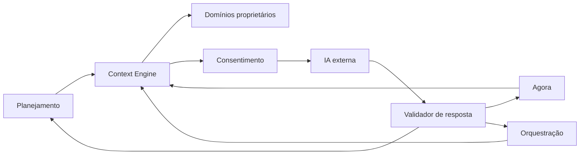

### B.2 Decision Engine — onde a IA não pode superar regras locais?

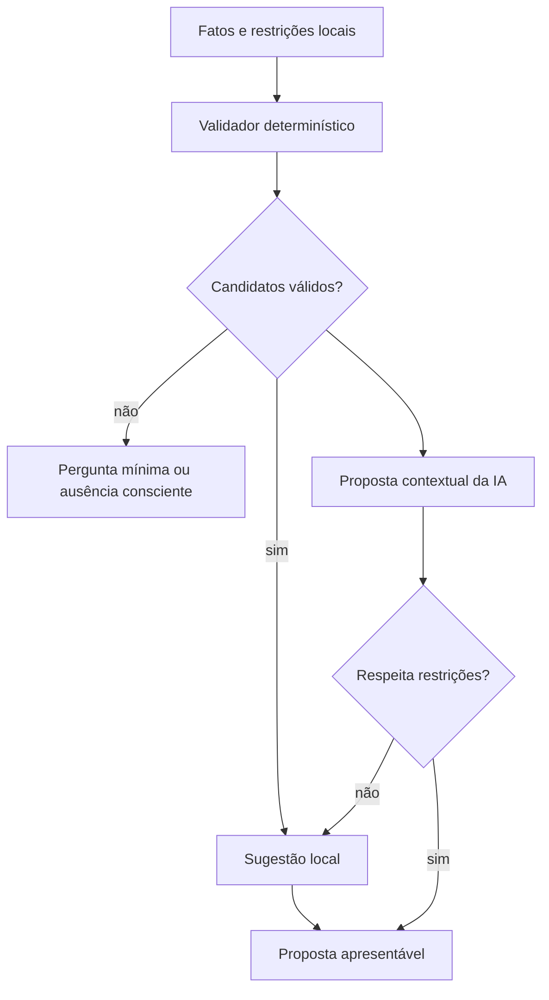

### B.3 Aprovação parcial — como evitar reiniciar o plano?

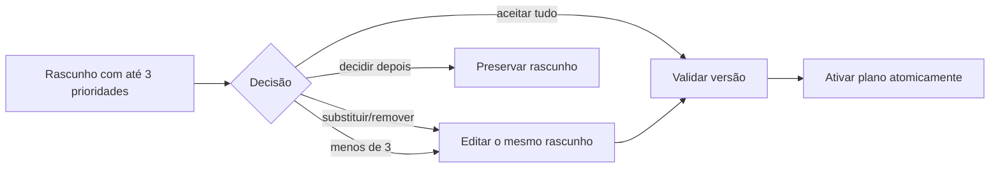

### B.4 Seleção do Agora — como uma orientação se torna ativa?

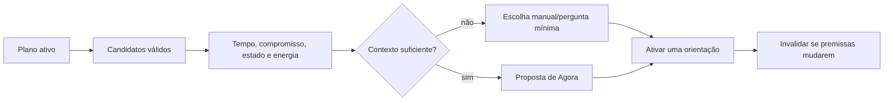

### B.5 Modo Foco — como preservar execução sem dar autoridade ao cronômetro?

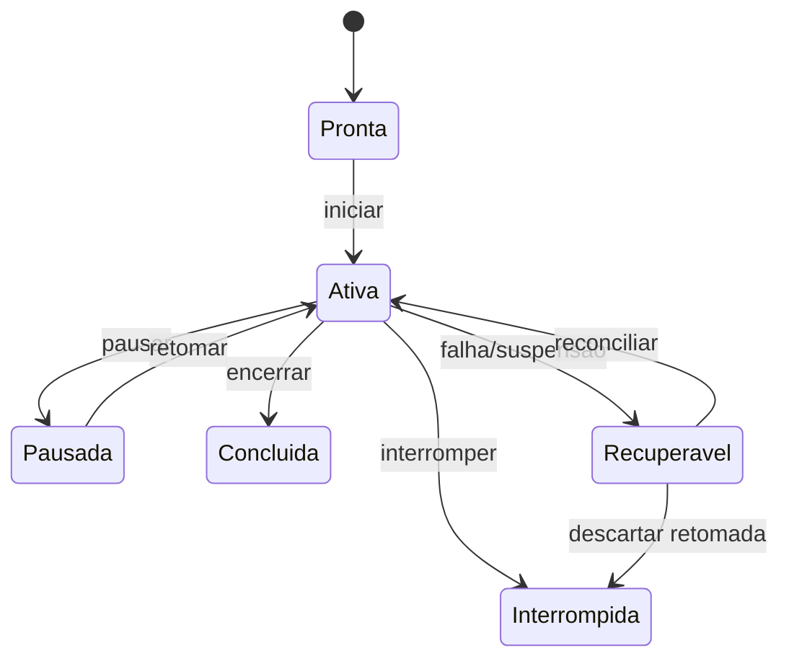

### B.6 Replanejamento — quando interromper?

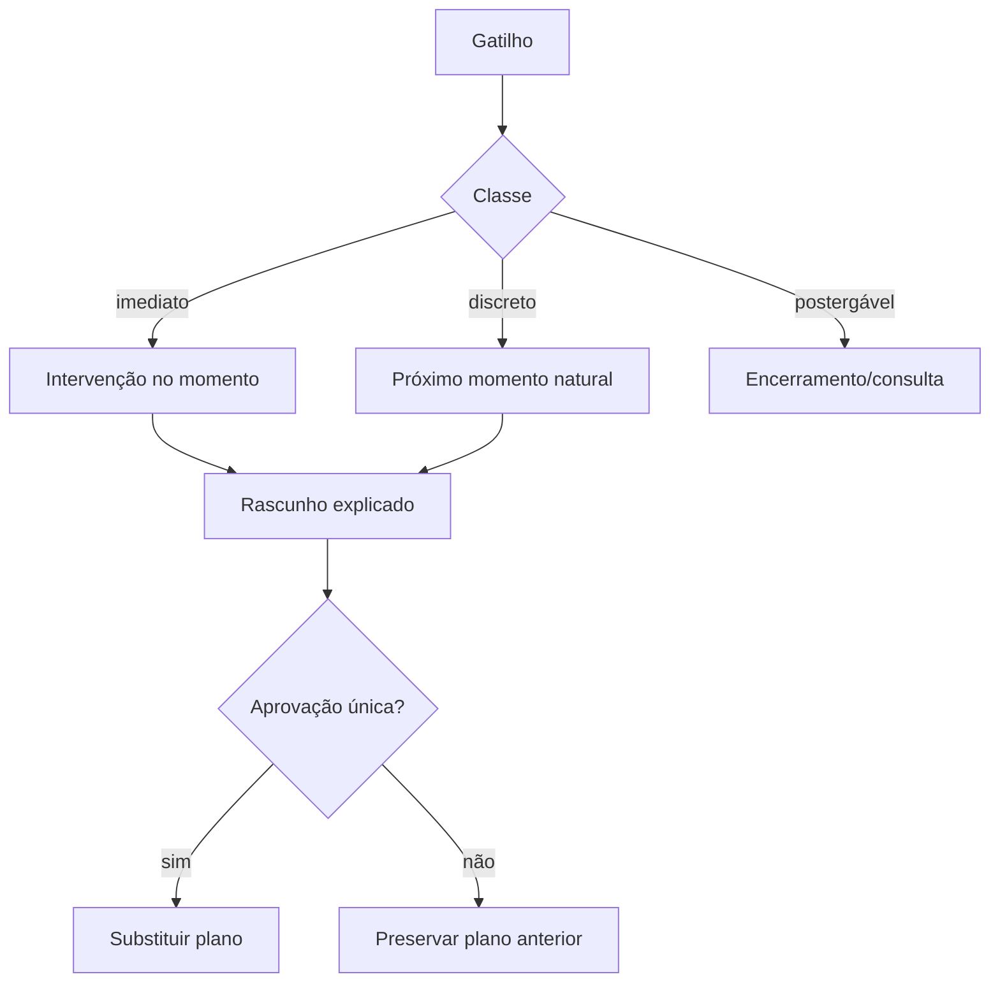

### B.7 Encerramento — como evitar movimentação silenciosa?

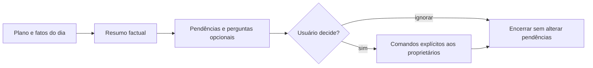

### B.8 Memória — como uma hipótese pode virar preferência?

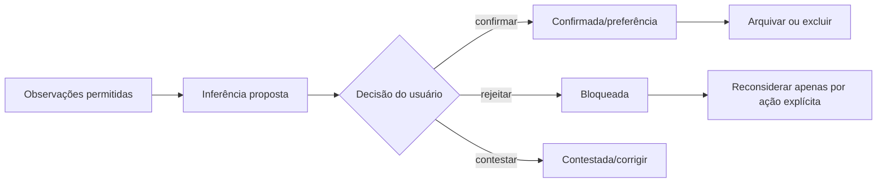

### B.9 Transmissão externa — quais estados impedem envio indevido?

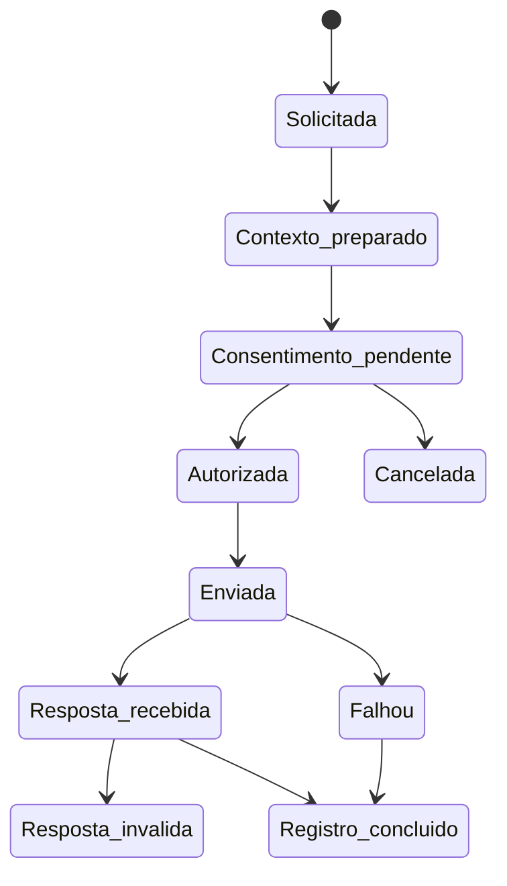

### B.10 Backup e restauração — quando o estado pode ser substituído?

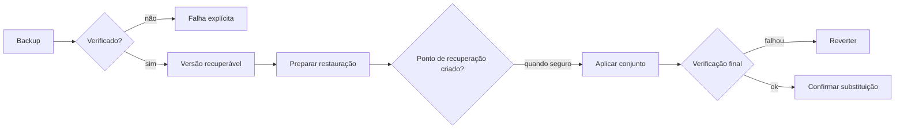

### B.11 Falha da IA — como o ciclo continua?

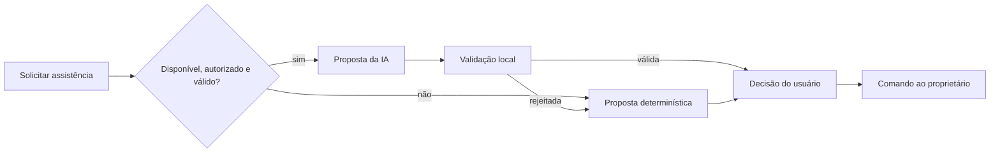

### B.12 Ciclo diário — onde ficam os pontos de decisão humana?

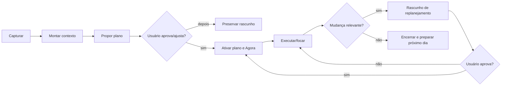
