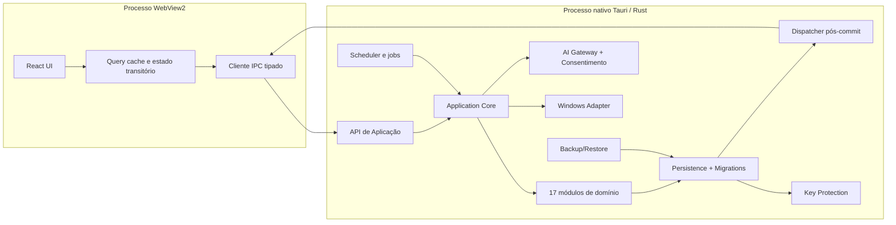
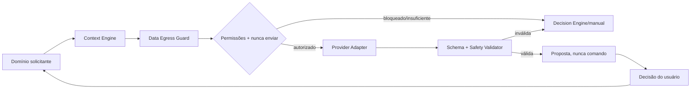

# Arquitetura Técnica — Second Brain OS v1.1

**Status:** Validada e congelada para preparação controlada da implementação  
**Fontes normativas:** PRD 1.2; Arquitetura Conceitual 1.0; Arquitetura Lógica 1.0  
**Data do congelamento:** 14 de julho de 2026  
**Escopo:** fundação técnica do MVP Windows Local First  
**Exclusões:** implementação, código, repositório, protótipo e novas funcionalidades

## 1. Resumo executivo

A arquitetura recomendada é um **monólito modular desktop** baseado em **Tauri 2**, com interface **React + TypeScript** executada no WebView2 do Windows e núcleo local em **Rust**. O estado operacional fica em **SQLite cifrado com SQLCipher**; a chave do banco e a credencial do provedor de IA são protegidas com **Windows DPAPI no escopo do usuário**. A IA externa é acessada exclusivamente por um gateway Rust que aplica consentimento, minimização, schemas estruturados e validação local. Não há backend remoto próprio no MVP.

O aplicativo utiliza dois ambientes de execução principais: o processo nativo Tauri, que contém aplicação, domínios, persistência, segurança e integrações com Windows; e o processo WebView, limitado à apresentação e à emissão de comandos tipados. Tarefas de fundo usam execução assíncrona dentro do processo nativo; não há serviço Windows, barramento distribuído nem processo worker permanente.

SQLite oferece transações locais e um formato maduro para anos de dados; SQLCipher atende à proteção contra leitura casual dos arquivos. DPAPI associa os segredos ao usuário do Windows — a documentação da Microsoft observa que dados protegidos normalmente só podem ser abertos pelo mesmo usuário no mesmo computador e incluem verificação de integridade. [Microsoft — CryptProtectData](https://learn.microsoft.com/en-us/windows/win32/api/dpapi/nf-dpapi-cryptprotectdata)

Tauri foi escolhido porque usa Rust no núcleo e HTML no WebView do sistema, comunica frontend e host por mensagens e não distribui um runtime Chromium próprio. Seu sistema de capabilities permite restringir APIs disponíveis por janela. [Tauri Architecture](https://v2.tauri.app/concept/architecture/), [Tauri Capabilities](https://v2.tauri.app/security/capabilities/)

## 2. Restrições e requisitos arquiteturais

| Grupo | Restrição técnica derivada |
|---|---|
| Local First | Toda fonte de verdade do MVP reside localmente; nuvem não é necessária para abrir, consultar ou alterar dados |
| Offline | Captura, planejamento manual/determinístico, Agora, foco, histórico e backup continuam sem rede |
| IA externa | Somente propostas estruturadas; nenhum acesso ao banco, filesystem geral ou dispatcher de comandos |
| Consentimento | Uma única fronteira técnica autoriza e registra qualquer saída de dados |
| Propriedade | Os 17 domínios permanecem módulos lógicos; persistência não expõe tabelas diretamente à UI |
| Consistência | Comandos críticos são transacionais e idempotentes; eventos internos só saem após commit |
| Privacidade | Banco, backups e segredos não ficam legíveis por acesso casual; logs são redigidos |
| Recuperação | Migrações, backup verificado, exportação e restauração possuem rollback ou compensação explícita |
| Windows | Inicialização, notificações, bandeja, suspensão e atualização integram-se ao sistema sem serviço privilegiado |
| Evolução | Schema versionado, migrações testadas e contratos C/Q/E/P versionados |
| MVP individual | Um processo nativo, um WebView principal e tarefas internas; nenhuma infraestrutura distribuída |
| Fornecedor substituível | Adapter de IA converte contrato interno estável para uma API externa; dados pessoais não assumem formato do fornecedor |

## 3. Comparação das alternativas

### 3.1 Shell desktop e linguagem principal

Critérios ponderados: segurança 20%, experiência Windows 15%, simplicidade solo 15%, memória/desempenho 15%, maturidade 10%, manutenção 10%, offline/empacotamento 10%, futuro multiplataforma 5%.

| Alternativa | Vantagens | Desvantagens e riscos | MVP/futuro | Decisão |
|---|---|---|---|---|
| Tauri 2 + Rust + Web UI | Binário compacto, usa WebView do SO, núcleo seguro e rápido, capabilities, plugins oficiais para tray/autostart/updater | Rust aumenta curva; variações do WebView2; ecossistema desktop menor que Electron | Ótimo consumo e isolamento; caminho futuro para macOS/Linux | **Recomendada** |
| Electron + TypeScript | Ecossistema enorme, Chromium consistente, atualizador e testes maduros | Maior memória/tamanho, superfície Node/Chromium, atualizações de segurança frequentes; Electron recomenda sandbox, context isolation, CSP e validação rigorosa de IPC | Entrega rápida, mas custo permanente maior | Reserva se Tauri/WebView2 bloquear UX essencial |
| Flutter + Dart | UI consistente e compilada; desktop Windows/macOS/Linux oficial | Nova linguagem, plugins Windows variáveis, renderização não nativa, integração de domínio Rust/SQLite cifrado acrescentaria ponte | Bom se mobile se tornar prioridade antecipada | Descartada para MVP |
| Avalonia + .NET | Forte desktop, multiplataforma, integração Windows e tooling .NET | Ecossistema/UI menor que web, adoção adicional; menos alinhada ao design web premium pretendido | Alternativa séria se equipe dominar C# | Segunda alternativa |
| WinUI 3/.NET | Integração Windows e acessibilidade nativas | Forte acoplamento ao Windows, distribuição e evolução cross-platform mais custosas | Excelente Windows puro | Descartada pela visão futura |

O Electron possui um processo principal Node e processos renderer Chromium; sua própria documentação ressalta sandbox, isolamento de contexto, CSP e validação do emissor IPC. [Electron Process Model](https://www.electronjs.org/docs/latest/tutorial/process-model), [Electron Security](https://www.electronjs.org/docs/latest/tutorial/security). Flutter compila aplicativos desktop nativos para Windows, macOS e Linux, mas exigiria Dart e uma estratégia separada para o núcleo. [Flutter Desktop](https://docs.flutter.dev/platform-integration/desktop). Avalonia suporta Windows, macOS e Linux por backends próprios. [Avalonia Architecture](https://docs.avaloniaui.net/docs/fundamentals/architecture)

**Revisar Tauri se:** WebView2 impedir acessibilidade/UX crítica; plugin Windows essencial for instável; tempo de domínio em Rust ameaçar o piloto; ou medições demonstrarem consumo/compatibilidade inadequados.

### 3.2 Frontend

| Alternativa | Avaliação | Decisão |
|---|---|---|
| React + TypeScript + Vite | Ecossistema maduro, componentes testáveis, bom encaixe Tauri e tipagem de contratos; React documenta suporte TypeScript e Vite como opção válida para app construído do zero | **Recomendada** |
| Svelte | Menos boilerplate e bundle pequeno; ecossistema/equipe futura menores | Reserva |
| Vue | Maduro e acessível; não oferece vantagem decisiva sobre experiência já prevista | Reserva |
| UI Rust/WASM | Uma linguagem, mas ecossistema e produtividade de UI desktop premium inferiores | Descartada |

Referências: [React com TypeScript](https://react.dev/learn/typescript), [React — build do zero](https://react.dev/learn/build-a-react-app-from-scratch).

Estado: **TanStack Query** para projeções assíncronas vindas do núcleo; `useReducer`/estado local para fluxos transitórios. Não usar Redux no MVP. O núcleo Rust continua fonte de verdade.

### 3.3 Persistência

| Alternativa | Vantagens | Desvantagens | Decisão |
|---|---|---|---|
| SQLite + SQLCipher | ACID local, consultas temporais, índices, backup consistente, um arquivo, cifragem transparente | Integração SQLCipher precisa spike; rotação/recuperação de chave exigem rigor | **Recomendada** |
| SQLite sem cifragem + ACL | Simples e maduro | Não atende “não legível por acesso casual” se arquivo for copiado pelo mesmo usuário | Rejeitada |
| Arquivos JSON/documentos | Fácil inspeção e exportação | Transações, concorrência, migração e consultas históricas frágeis | Rejeitada |
| Banco embutido key-value | Rápido e simples | Relações/consultas e migrações mais artesanais | Rejeitada |
| Banco servidor local | Recursos robustos | Processo, instalação, memória e recuperação excessivos | Rejeitada |

Driver recomendado: `rusqlite` com SQLCipher compilado e controlado pelo aplicativo. Migrações SQL numeradas, embutidas, monotônicas e executadas pelo núcleo antes de liberar comandos.

### 3.4 Comunicação interna

| Alternativa | Avaliação | Decisão |
|---|---|---|
| Comandos Tauri tipados request/response | Fronteira explícita WebView→Rust, capabilities e validação central | **Recomendada** |
| Servidor HTTP local | Ferramentas conhecidas, mas cria porta, autenticação e superfície de ataque desnecessárias | Rejeitada |
| Acesso direto da UI ao SQLite | Simples no início, viola domínios e segurança | Proibida |
| Barramento distribuído | Excesso para monólito local | Proibido no MVP |

Eventos UI são notificações de invalidação/progresso, nunca fonte de verdade. A UI refaz uma consulta após receber evento relevante.

### 3.5 IA externa

| Alternativa | Vantagens | Riscos | Decisão |
|---|---|---|---|
| OpenAI Responses API via adapter | Structured Outputs, modelos atuais e endpoint unificado; boa validação das nove propostas | Custo, rede, retenção/políticas e dependência externa | **Adapter inicial recomendado**, modelo configurável |
| Outro provedor com saída estruturada | Diversificação | Duplicar integração cedo | Adapter futuro, não MVP |
| Modelo local | Privacidade/offline | Hardware, tamanho, qualidade e distribuição | Porta futura |
| SDK de agentes com ferramentas | Orquestração pronta | Autoridade e complexidade superiores ao necessário | Rejeitado no MVP |

Modelos OpenAI atuais oferecem Responses API e Structured Outputs; a arquitetura não fixa um modelo específico e exige avaliação antes da implementação. [OpenAI Models](https://developers.openai.com/api/docs/models)

### 3.6 Empacotamento, instalação e atualização

| Alternativa | Avaliação | Decisão |
|---|---|---|
| Instalador NSIS assinado + Tauri Updater assinado | Compatível com distribuição direta e Tauri; simples para piloto | **MVP** |
| MSI | Familiar em empresas, mas menos conveniente para atualização direta | Artefato opcional posterior |
| MSIX/App Installer | Instalação limpa, identidade e atualização Windows; assinatura/distribuição mais exigentes | Revisar pós-piloto/Store |
| Microsoft Store | Confiança e updates | Processo externo e regras de publicação | Pós-MVP |

MSIX é o formato moderno da Microsoft para instalação confiável e acesso a recursos ligados à identidade do pacote, mas não é necessário ao piloto pessoal. [Microsoft MSIX](https://learn.microsoft.com/en-us/windows/msix/). O updater Tauri suporta artefatos assinados e deve ser configurado para nunca aplicar atualização silenciosamente durante foco. [Tauri Updater](https://v2.tauri.app/plugin/updater/)

## 4. Stack técnica recomendada

| Área | Escolha |
|---|---|
| Shell | Tauri 2 |
| Núcleo | Rust stable, monólito modular |
| Interface | React + TypeScript, Vite, HTML/CSS acessível |
| Estado UI | TanStack Query + estado/reducers locais |
| Persistência | SQLite + SQLCipher; `rusqlite`; WAL e foreign keys |
| Migrações | SQL numerado, embutido, checksum e transação por versão |
| IPC | Tauri commands tipados; eventos Tauri mínimos para invalidação/progresso |
| Background | tarefas assíncronas Rust persistidas; sem serviço Windows |
| IA | gateway Rust; adapter OpenAI Responses inicialmente; JSON Schema |
| Credenciais/chaves | DPAPI user-scope; segredos nunca no WebView |
| Notificações | app notifications locais do Windows via adapter nativo/Tauri |
| Autostart/tray | plugins oficiais Tauri; preferência explícita |
| Backup | snapshot SQLite consistente + manifesto + integridade + cifragem |
| Exportação portátil | contêiner versionado cifrado por senha de recuperação |
| Instalador | NSIS per-user assinado; x64 inicialmente |
| Atualização | Tauri Updater assinado, opt-in, backup pré-migração |
| Testes | Rust unit/integration/property; React component; IPC contract; Windows E2E |
| Logs | tracing estruturado local, redaction e rotação |

### 4.1 Matriz completa de decisões técnicas

| Decisão | Alternativas consideradas | Recomendação e impacto | Riscos / condição de revisão |
|---|---|---|---|
| Shell | Tauri, Electron, Flutter, Avalonia, WinUI | Tauri 2; menor footprint e núcleo Rust | revisar por incompatibilidade WebView/UX |
| Linguagem principal | Rust, TypeScript/Node, C#, Dart | Rust no núcleo; segurança de memória e desempenho | revisar se curva impedir piloto |
| Frontend | React, Vue, Svelte, Flutter | React+TypeScript; ecossistema e testabilidade | revisar se bundle/complexidade medidos forem ruins |
| Aplicação local | núcleo Tauri, servidor HTTP local, serviço Windows | núcleo Tauri modular | revisar somente se isolamento exigir processo |
| Persistência | SQLite/SQLCipher, JSON, KV, servidor local | SQLite+SQLCipher | spike pode exigir driver alternativo, não outro modelo sem ADR |
| Migração | SQL embutido, ORM auto-migration, recriação | SQL numerado/checksum | revisar se schema exigir ferramenta mais forte |
| Estado UI | TanStack Query, Redux, Zustand, apenas React | Query + reducers locais | adicionar store só com dor comprovada |
| Comunicação | Tauri IPC, HTTP localhost, acesso direto, bus | Tauri commands/events mínimos | revisar para múltiplos processos/clientes |
| Background | async in-process, worker process, Windows Service | jobs Rust in-process persistidos | separar worker por crash/CPU medidos |
| Notificações | Windows local, plugin abstrato, custom overlay | adapter para app notifications | revisar para outro SO |
| Autostart | plugin Tauri, registry manual, Scheduled Task | plugin oficial/per-user | adapter nativo se plugin falhar |
| IA | Responses API adapter, outro provedor, local, Agents SDK | adapter OpenAI inicial + contrato neutro | trocar por qualidade/custo; sem migrar dados |
| Credenciais | DPAPI, Credential Locker, arquivo cifrado | DPAPI user-scope | adapter equivalente em outro SO |
| Dados em repouso | SQLCipher, ACL, field encryption | SQLCipher + DPAPI key | field encryption adicional só por ameaça comprovada |
| Backup | snapshot cifrado, cópia bruta, dump textual | snapshot consistente + contêiner versionado | revisar formato por anexos/sync futuro |
| Update | Tauri Updater, MSIX, Store, manual | updater assinado opt-in; manual no piloto se necessário | migrar para MSIX/Store na distribuição pública |
| Instalador | NSIS, MSI, MSIX | NSIS per-user assinado | revisar para enterprise/Store |
| Testes | Rust/React/E2E, só E2E, só unitários | pirâmide + contratos + fault injection | ajustar proporção pelas falhas reais |
| Observabilidade | logs locais, SaaS, Event Log | tracing local redigido | externo somente por opt-in formal |
| Distribuição | download assinado, Store, package manager | download privado/assinado no MVP | Store quando produto público |

Para todas as linhas, a compatibilidade mínima é a mesma: preservar limites dos 17 domínios, offline, consentimento, propostas sem mutação, transações, recuperação e rastreabilidade. Nenhuma alternativa descartada reduz esses contratos; ela apenas muda o mecanismo físico.

## 5. Visão física



### 5.1 Componentes físicos definidos

1. React UI.
2. Cliente IPC e cache de projeções.
3. Tauri Host/API de aplicação.
4. Application Core e dispatcher C/Q/E/P.
5. Módulos de domínio.
6. Persistence/Migration Engine.
7. AI Gateway e adapters.
8. Consent/Data Egress Guard.
9. Windows Integration Adapter.
10. Background Job Scheduler.
11. Backup/Export/Restore Engine.
12. Security/Key Store.
13. Local Observability.

Os 52 componentes lógicos são tipos/serviços internos desses 13 componentes físicos, não 52 processos ou pacotes.

## 6. Estrutura de processos

### 6.1 Processo nativo principal

Responsável por ciclo de vida, comandos, domínios, SQLite, IA, jobs, notificações, tray e segurança. Uma instância por usuário. Possui exclusão lógica contra duas instâncias gravadoras.

### 6.2 WebView2

Renderiza somente ativos locais. Sem Node, acesso direto a filesystem, rede genérica, banco ou segredos. CSP restritiva; navigation/new-window bloqueadas por padrão; capabilities Tauri permitem apenas comandos necessários à janela.

### 6.3 Tarefas em segundo plano

Rodam no processo nativo como jobs cooperativos: backup, verificação, convite/alerta, atualização e manutenção. Jobs duráveis mantêm estado no banco e retomam após reinício. CPU pesada opcional usa pool bloqueante interno; não criar processo worker até medições mostrarem necessidade.

### 6.4 Suspensão e retomada

Na suspensão: checkpoint lógico de sessões/jobs, nenhuma suposição de timers contínuos. Na retomada: reconciliar relógio/fuso, sessão de foco, compromissos iminentes e jobs vencidos antes de emitir notificações. Não “recuperar” notificações antigas em massa.

### 6.5 Isolamento

Falha do WebView não corrompe estado confirmado. Falha de IA, notificação, métrica ou log não aborta transação de domínio. Falha fatal do processo é recuperada por transações SQLite, journal e marcador de sessão.

## 7. Arquitetura de dados

### 7.1 Modelo

- Um banco operacional cifrado por perfil local.
- Tabelas organizadas por prefixo/módulo, sem schemas físicos separados.
- Chaves opacas estáveis; timestamps UTC + intenção/fuso local quando temporalmente necessário.
- Estado atual normalizado; histórico append-only seletivo, não event sourcing integral.
- Propostas e rascunhos persistidos com versão, contexto, expiração e status.
- Payloads externos temporários não persistidos por padrão.

### 7.2 Transações

- Um dispatcher serializa comandos mutantes no núcleo.
- Cada comando de domínio executa validação e mutação em uma transação curta.
- Eventos internos são registrados numa outbox local na mesma transação quando outro componente precisa reagir.
- Consumidores idempotentes marcam processamento; projeções podem ser reconstruídas.
- Consultas usam snapshots consistentes; WAL permite leitura enquanto há escrita curta.

### 7.3 Índices iniciais

Por estado/data da tarefa; compromisso por intervalo; plano por dia/status; Agora por ativo; eventos por entidade/correlação/tempo; memória por tipo/status/atualidade; permissões por categoria/operação; transmissões por tempo; jobs por estado/próxima execução. Índices adicionais somente após medição.

### 7.4 Migrações

Tabela de versão e checksum. Backup verificado antes de migração destrutiva. Migrações forward-only, repetíveis em banco de teste, com validação de invariantes e `integrity_check`. Falha impede abertura para escrita e oferece restauração; nunca continua parcialmente.

### 7.5 Proteção em repouso

- SQLCipher para páginas do banco.
- Chave aleatória por instalação/perfil, nunca derivada de segredo fixo no binário.
- Chave envelopada com DPAPI user-scope, sem `CRYPTPROTECT_LOCAL_MACHINE`.
- API key do fornecedor também protegida por DPAPI.
- Backups usam chave independente; exportação portátil usa derivação de senha robusta (Argon2id) e AEAD de biblioteca auditada.
- Chaves plaintext vivem apenas na memória nativa pelo menor tempo possível e nunca entram em logs/UI.

Limite: malware executando como o mesmo usuário pode invocar recursos e capturar dados em uso; DPAPI/SQLCipher protegem arquivos em repouso e acesso casual, não um sistema comprometido.

### 7.6 Retenção e anos de histórico

Dados pessoais preservados por padrão. Diagnóstico rotacionado por tamanho/tempo. Auditoria técnica configurável. Testar pelo menos 1 milhão de registros históricos e dez anos de datas simuladas. Compactação/checkpoint e manutenção apenas ociosas, canceláveis e observáveis.

## 8. Comandos, consultas, eventos e propostas

### 8.1 Representação

Contratos compartilhados possuem versão, correlação, causalidade e tipos gerados/validados nos dois lados. TypeScript não define o domínio; schemas canônicos ficam no núcleo e alimentam bindings.

### 8.2 Dispatch

`invoke` Tauri → allowlist/capability → validação de envelope → autenticação da janela → command/query dispatcher → handler de aplicação → domínio → transação → outbox → resultado. Erros retornam códigos estáveis e detalhes seguros.

### 8.3 Eventos

Os 35 eventos são mensagens internas pós-commit. Dispatcher in-process + outbox SQLite; sem Kafka/RabbitMQ. Ordenação apenas por entidade/versão. Duplicados são ignorados por id. Falha de consumidor mantém pendência com retry limitado; consumidor auxiliar pode ir a dead-letter local sem bloquear o comando já confirmado.

Eventos enviados à UI carregam somente id/versão/tipo e instruem invalidar consulta. A UI nunca reconstrói verdade operacional apenas pelo evento.

### 8.4 Idempotência

Os 37 comandos recebem `request_id` nos casos mutantes. Resultado do comando crítico fica associado à chave pelo período necessário; repetição devolve resultado original. Consultas são side-effect free. As 9 propostas têm id, schema version, validade e fingerprint das fontes.

## 9. Arquitetura da IA



### 9.1 Componentes

- **Context Engine:** consulta domínios por finalidade, separa fatos/preferências/inferências, marca origem/atualidade e calcula suficiência.
- **Data Egress Guard:** aplica consentimento por categoria, “nunca enviar”, minimização e registro.
- **AI Orchestrator:** seleciona operação, schema, orçamento, timeout e adapter.
- **Provider Adapter:** traduz contrato neutro para Responses API; nenhum objeto do fornecedor entra nos domínios.
- **Proposal Validator:** valida JSON Schema, limites (máximo 3 prioridades), referências existentes, expiração e restrições determinísticas.
- **Decision Engine:** fallback previsível e validador inegociável.

### 9.2 Política operacional

- Um único adapter externo no MVP; interface interna pequena: enviar contexto estruturado, receber proposta estruturada, cancelar.
- Um modelo configurado por operação, sem id persistido nos dados pessoais; pin de snapshot durante o piloto quando disponível.
- Timeout inicial: 20 s por tentativa, 30 s total percebido; no máximo um retry com jitter apenas para falha transitória antes de qualquer resposta.
- Sem retry de validação sem mudar prompt/contexto; após resposta inválida, fallback.
- Custo: limite de tokens por operação, tamanho máximo por categoria, cache somente de contexto não sensível/efêmero e relatório local de uso.
- Credencial apenas no núcleo nativo via DPAPI; nunca no WebView ou backup.
- Prompt injection: conteúdo do usuário é dado não confiável, delimitado e nunca interpretado como instrução de sistema; o modelo não recebe ferramentas mutantes.
- Histórico registra serviço, operação, categorias, referências, resultado, latência e custo estimado; não duplica payload.
- Modelo local futuro implementa o mesmo contrato de proposta, sem exigir migração de dados.

## 10. Segurança e privacidade

### 10.1 Modelo de ameaças

| Ameaça | Controle MVP | Limite residual |
|---|---|---|
| Leitura casual/copiar arquivos | SQLCipher, ACL padrão, chave DPAPI usuário | malware no mesmo usuário pode acessar processo |
| Conta Windows compartilhada | DPAPI user-scope; recomendar conta individual | mesma conta compartilha acesso |
| Roubo da API key | DPAPI, núcleo nativo, redaction, nunca UI | processo comprometido pode capturar em uso |
| Backup perdido | cifragem independente + integridade | senha de recuperação fraca reduz proteção |
| Exportação indevida | confirmação, destino explícito, aviso de sensibilidade | usuário pode compartilhar conscientemente |
| Envio externo excessivo | egress guard, allowlist, minimização, item bloqueado | políticas do fornecedor continuam aplicáveis |
| Logs sensíveis | campos estruturados allowlist, redaction, retenção | mensagens de erro de dependência exigem saneamento |
| Temporários | diretório privado, conteúdo cifrado ou memória, limpeza | exclusão segura em SSD não é garantível |
| Backup malicioso | manifesto versionado, hash/MAC, validação antes de substituir | arquivo válido antigo pode conter dados indesejados; requer confirmação |
| Banco manipulado | SQLCipher MAC, constraints, integrity check | corrupção legítima ainda possível |
| Prompt injection | conteúdo tratado como dado, schemas, sem tools, validação local | modelo pode sugerir conteúdo ruim, sujeito à aprovação |
| WebView comprometido/XSS | CSP, ativos locais, no navigation, capabilities mínimas, IPC validado | vulnerabilidade do WebView exige atualização do Windows |
| Supply chain | lockfiles, SBOM, pin, atualização dependências, assinatura | dependência comprometida continua risco |

### 10.2 Fronteiras

WebView é não confiável para segredos. IPC aceita apenas comandos allowlisted e valida origem/janela/payload. Rede do app é negada ao frontend; somente AI Gateway e Updater possuem destinos explícitos. Nenhum conteúdo remoto é renderizado como HTML executável.

## 11. Backup, exportação e restauração

### 11.1 Formato

Contêiner versionado `.sbosbackup` contendo manifesto canônico, snapshot consistente cifrado do banco, anexos futuros permitidos pelo formato e lista de hashes. Sem formato físico dependente de tabelas exposto como contrato público.

### 11.2 Proteção

- Backup automático local: chave aleatória de backup, protegida por DPAPI e opcionalmente por segredo de recuperação para portabilidade.
- Exportação portátil: senha obrigatória, Argon2id com parâmetros gravados no manifesto e AEAD autenticado.
- Nunca incluir API keys, chave DPAPI ou diagnóstico por padrão.

### 11.3 Processo

Snapshot pela API consistente do SQLite; verificação de integridade antes de marcar recuperável; retenção diária com múltiplas versões configuráveis. Restauração abre em área isolada, valida versão/manifesto/MAC/schema, cria ponto de recuperação, fecha escrita, substitui atomicamente, executa migrações compatíveis e faz smoke check. Falha reverte.

Compatibilidade: versão atual restaura mesma versão e versões anteriores suportadas por migrações. Backup de versão futura é recusado com mensagem clara.

## 12. Integração com Windows

- **Suporte inicial:** Windows 11 x64 em versões ainda suportadas pela Microsoft; baseline operacional Windows 11 24H2. ARM64 é alvo posterior de build, sem alterar arquitetura.
- **WebView2:** requisito verificado pelo instalador; usar evergreen runtime.
- **Autostart:** plugin oficial Tauri, per-user, desativável; iniciar em primeiro plano ou tray conforme preferência. [Tauri Autostart](https://v2.tauri.app/plugin/autostart/)
- **Notificações:** notificações locais do Windows, com tag/grupo para suprimir duplicadas; Windows permite notificações locais exibidas fora da janela. [Microsoft App Notifications](https://learn.microsoft.com/en-us/windows/apps/develop/notifications/app-notifications/)
- **Notificações — evidência SPK-04:** política, deduplicação e reconciliação pertencem ao núcleo; o adapter Windows somente entrega e devolve interação. O plugin oficial cobre entrega, mas a interação desktop exige reter o handle WinRT por adapter híbrido/equivalente. Conteúdo sensível vira mensagem genérica; contexto de navegação usa allowlist; nenhuma ação estrutural parte do toast.
- **Tray:** menu mínimo abrir, modo silencioso e sair; fechar janela minimiza/oculta ou encerra conforme preferência explícita. O SPK-04 confirmou que destruir a última WebView exige impedir explicitamente o `ExitRequested` enquanto o núcleo estiver ativo; “Sair” libera essa barreira, persiste checkpoint e encerra o processo.
- **Instância única:** registrar o plugin/guard antes dos demais adapters; a segunda instância apenas sinaliza a primeira com contexto seguro e encerra antes de criar scheduler, tray ou banco concorrente.
- **Background:** somente enquanto o processo está em execução; nenhum Windows Service.
- **Suspensão/hibernação:** reconciliar tempo e jobs na retomada.
- **Estratégia temporal validada pelo SPK-03:** usar tempo monotônico somente no trecho contínuo do processo, UTC de parede para agenda e timestamps persistidos com intenção/fuso local para reconstrução. No startup/retomada, invalidar projeções, recuperar sessões incompletas e classificar jobs de forma idempotente antes de notificar. O adapter Win32 orientado por mensagens permanece no núcleo Rust; UI/WebView não é autoridade temporal e o MVP não requer Windows Service. Validação física de S3, hibernação, lock/unlock e reboot permanece como condição de compatibilidade do adapter.
- **Instalação:** per-user sem elevação quando possível; assinatura de código antes de distribuição externa.
- **Desinstalação:** remove binários/configuração; dados pessoais exigem escolha explícita no desinstalador ou dentro do app, evitando perda silenciosa.
- **Dados:** diretório de dados de aplicação do usuário; backups somente no destino escolhido.
- **Atualização:** verificar em background configurável; baixar artefato assinado; aplicar somente com decisão do usuário e fora de foco; backup pré-migração.

## 13. Estratégia de falhas

| Falha lógica | Detecção técnica | Isolamento/fallback | Recuperação |
|---|---|---|---|
| IA indisponível/timeout | erro/timeout tipado | cancelar; Decision Engine | nova tentativa manual |
| Resposta inválida | JSON Schema + regras | descartar integralmente | fallback e diagnóstico redigido |
| Consentimento negado | egress guard | não abrir conexão | contexto local/manual |
| Falha de persistência | erro transacional | rollback | retry seguro ou modo leitura/recuperação |
| Evento duplicado/fora de ordem | id + versão | dedup/reconsulta proprietário | reprocessar outbox |
| Suspensão durante foco | comparação de marcos | marcar recuperável | usuário confirma tempo |
| Plano desatualizado | versão das fontes | invalidar projeção | criar rascunho |
| Backup falhou/corrompeu | status + hash/MAC/integrity | preservar último válido | repetir em novo destino |
| Restauração falhou | estágio persistido | bloquear abertura do estado parcial | rollback ao ponto |
| Disco cheio | erro do SO + pré-checagem | abortar escrita grande | liberar espaço; integridade check |
| Relógio/fuso alterado | eventos/lacuna temporal | invalidar derivados | reconciliar antes de notificar |
| Crash | journal + marcador de sessão | SQLite rollback/WAL | recuperação de sessão/jobs |
| Notificação/log/métrica falhou | resultado auxiliar | não abortar núcleo | retry limitado/dead-letter local |

## 14. Testabilidade

| Camada | Estratégia |
|---|---|
| Domínio | unitários puros para estados, invariantes e Decision Engine |
| Contratos | schema tests C/Q/E/P; compatibilidade de versões; bindings TypeScript |
| Persistência | banco temporário cifrado; transação, concorrência, migração e corrupção simulada |
| Integração | handlers → domínio → SQLite → outbox; adapters Windows simulados |
| UI | componentes, teclado, leitores de tela, reducers e estados antes/depois da aprovação |
| E2E Windows | instalador, primeiro uso, autostart, tray, notificação, suspensão/retomada e update controlado |
| Falhas | fault injection para disco, IA, evento, backup, relógio e crash |
| Consentimento | propriedade: nenhum item bloqueado aparece em pacote; revogação bloqueia futuras chamadas |
| Segurança | CSP, capability allowlist, IPC fuzzing, secrets scanning, restore malicioso |
| IA | servidor simulado com nove schemas, timeout, erro, texto livre, referências inexistentes e injection |
| Backup | round-trip, versões, senha errada, MAC inválido, futuro incompatível e rollback |
| Rastreabilidade | matriz automatizada requisito → teste/handler/componente |

## 15. Observabilidade Local First

Logs estruturados no processo nativo com níveis error/warn/info/debug/trace; produção usa info com allowlist. `correlation_id`, componente, código de erro, duração e versão; jamais título de tarefa, texto capturado, prompt, API key, chave, payload ou caminho escolhido completo.

Rotação por tempo e tamanho, retenção padrão de 14 dias para diagnóstico técnico, configurável. Auditoria pessoal e transmissão ficam no banco, separadas dos logs. Exportação diagnóstica exige ação e apresenta conteúdo a ser incluído. Nenhuma telemetria externa por padrão.

## 16. Metas iniciais de desempenho

| Métrica do piloto | Meta inicial |
|---|---|
| Cold start até interface utilizável | p95 ≤ 2,5 s em hardware-alvo |
| Warm start | p95 ≤ 1,0 s |
| Feedback visual de ação | ≤ 100 ms |
| Consulta local comum | p95 ≤ 50 ms |
| Comando local comum | p95 ≤ 150 ms |
| Construção determinística do plano | p95 ≤ 300 ms |
| Memória após estabilização | alvo ≤ 180 MB; teto investigativo 250 MB |
| CPU ociosa em tray | média < 1% |
| Banco com 10 anos/1M eventos | consultas principais dentro das metas após índices |
| Timeout IA | 20 s tentativa; 30 s total antes de fallback |
| Backup incremental lógico diário | não bloquear UI; progresso/cancelamento |

Metas serão medidas no piloto e revistas por ADR, sem relaxar UX ou privacidade silenciosamente.

## 17. Estrutura recomendada do repositório

```text
second-brain-os/
  app-ui/                 # React, projeções, acessibilidade, cliente IPC
  src-tauri/
    application/          # dispatch C/Q, casos de uso e transações
    domains/              # 17 pastas de domínio preservadas
    contracts/            # schemas versionados C/Q/E/P e bindings
    infrastructure/
      persistence/        # SQLite, SQLCipher, migrations, outbox
      ai/                 # gateway, adapter e schemas
      windows/            # notifications, tray, autostart, lifecycle
      security/           # DPAPI, egress guard, redaction
      backup/             # snapshot, export, restore
      observability/      # logs e diagnóstico local
    jobs/                 # scheduler e handlers duráveis
  migrations/
  tests/
    contracts/
    integration/
    e2e-windows/
    fixtures-ai/
  docs/adr/
```

Regra: UI depende de contratos, nunca de infrastructure/domains. Application depende de domains/contracts. Domains não dependem de Tauri, React, SQLite, OpenAI ou Windows. Infrastructure implementa portas definidas por application/domains. Nenhum domínio importa outro repositório diretamente; colaboração passa por casos de uso, consultas ou eventos aprovados.

## 18. ADRs iniciais

| ADR | Decisão | Alternativas | Revisão |
|---|---|---|---|
| ADR-001 | Aplicativo desktop Local First sem backend próprio | web/cloud, servidor local | colaboração/sync virar requisito |
| ADR-002 | Tauri 2 + Rust + WebView2 | Electron, Flutter, Avalonia, WinUI | bloqueio de UX, acessibilidade ou produtividade |
| ADR-003 | React + TypeScript + Vite | Svelte, Vue, Flutter UI | manutenção/ecossistema mudar materialmente |
| ADR-004 | SQLite + SQLCipher + migrações embutidas | arquivos, KV, servidor local | volume/concorrência exceder modelo pessoal |
| ADR-005 | Monólito modular, um processo nativo | microserviços/processos por domínio | isolamento medido exigir processo separado |
| ADR-006 | Comandos IPC tipados e eventos internos pós-commit | HTTP local, event bus distribuído | múltiplos clientes/processos legítimos |
| ADR-007 | IA por adapter; propostas sem mutação | agent/tool calling mutante | nunca sem revisão do PRD |
| ADR-008 | Fronteira única de consentimento/egress | chamadas por módulo | nunca; é invariante normativa |
| ADR-009 | DPAPI user-scope + SQLCipher | Credential Locker, plaintext/ACL | expansão multiplataforma exige adapter equivalente |
| ADR-010 | Backup cifrado, verificado e portátil por senha | cópia de arquivo, nuvem | sync/backup cloud aprovado |
| ADR-011 | NSIS assinado + updater Tauri | MSI, MSIX, Store | distribuição pública/Store |
| ADR-012 | Observabilidade local sem telemetria padrão | SaaS telemetry | opt-in formal aprovado |

**Evidência ADR-002/ADR-005 — SPK-03 (15/07/2026):** processo Rust nativo com janela Win32 oculta recebeu rotas de lifecycle sem WebView e permaneceu ocioso sem polling; reconciliação, idempotência e recovery entre processos foram aprovados. Resultado **APROVADO COM CONDIÇÕES** porque transições físicas S3/hibernação/lock/reboot ainda exigem ensaio manual secundário. A decisão de Tauri + núcleo Rust em processo único, sem Windows Service, permanece aceita.

**Evidência ADR-002/ADR-005/ADR-011 — SPK-04 (15/07/2026):** Tauri 2 entregou toast instalado, tray, single-instance, núcleo sem WebView e NSIS per-user sem Windows Service. Política e scheduler permaneceram no Rust; capabilities da WebView ficaram em `core:default`. Resultado **APROVADO COM CONDIÇÕES** por clique/menu manual, Explorer, lock screen e suspensão física. A interação Windows requer adapter que retenha o handle WinRT; isso refina infraestrutura, sem alterar os ADRs.

## 19. Mapeamento lógico para físico

| Domínio lógico | Componentes lógicos | Módulo físico | Persistência | Interfaces/dependências |
|---|---|---|---|---|
| Orquestração | 3 | application/orchestration | sessões/check-ins | UI, Plano, Agora, Foco |
| Captura | 3 | domains/capture | capture_items | application, AI port |
| Ações e Projetos | 2 | domains/actions | tasks, projects, links | Plano, Execução |
| Agenda e Disponibilidade | 3 | domains/schedule | commitments, recurrence, availability | Plano, Windows time |
| Objetivo Semanal | 1 | domains/weekly_goal | weekly_goals | Plano |
| Planejamento | 7 | domains/planning | plans, drafts, priorities | actions/schedule/goal ports, AI/Det. |
| Agora | 3 | domains/now | now_orientations | Plano, Execução |
| Execução e Foco | 3 | domains/execution | focus_sessions, time_records | Agora, actions |
| Assistência Inteligente | 4 | infrastructure/ai + application/context | requests metadata only | Consent, domain queries |
| Orientação Determinística | 3 | domains/deterministic_guidance | rule version/config | read ports only |
| Memória | 2 | domains/memory | memories, inferences | Histórico, AI |
| Preferências | 2 | domains/preferences | preferences, attention | Windows/Notifications |
| Consentimento | 4 | domains/consent + security/egress | permissions, blocked_items, transmissions | AI Gateway |
| Histórico | 4 | domains/history + observability | history, audit, outbox, diagnostics files | todos pós-commit |
| Backup | 3 | infrastructure/backup | backup metadata | Persistence, Security |
| Notificações | 2 | infrastructure/windows/notifications | notification state/jobs | Preferences, Orchestration |
| Métricas | 3 | domains/validation_metrics | evaluations, metric snapshots | Histórico, UI |

## 20. Rastreabilidade

| Contrato congelado | Materialização técnica |
|---|---|
| 17 domínios | 17 módulos sob `domains`/application/infrastructure com propriedade preservada |
| 52 componentes | tipos/serviços mapeados aos 13 componentes físicos e tabela acima |
| 37 comandos | IPC schemas → application dispatcher → transaction handler |
| 18 consultas | query handlers → projeções tipadas; cache UI invalidável |
| 35 eventos | outbox pós-commit + dispatcher in-process e consumidores idempotentes |
| 9 propostas | JSON Schemas versionados + validador local + expiração |
| 8 máquinas | enums/transition guards + testes de transição |
| 22 fluxos | integration/E2E suites por cenário feliz/incompleto/rejeição/falha |
| 15 invariantes | constraints, guards transacionais e property tests |
| 181 requisitos | matriz requisito→componente→handler→teste mantida em documentação/CI |

## 21. Riscos e trade-offs

| Risco | Impacto | Mitigação / aceitação |
|---|---|---|
| Curva de Rust | atraso do MVP | arquitetura simples, poucos crates, spike inicial |
| SQLCipher/toolchain Windows | build/assinatura | spike de build, restore e migração antes de features |
| WebView2 inconsistente | UX | baseline Windows 11, E2E e fallback visual |
| Tauri plugins | dependência | adapters próprios; plugins oficiais mínimos |
| Dois sistemas de tipos | drift Rust/TS | schemas canônicos e bindings gerados/testados |
| Outbox complexa | excesso arquitetural | usar apenas 35 eventos relevantes; dispatcher in-process |
| DPAPI prende chave ao perfil/máquina | recuperação | backup portátil por senha; não copiar banco bruto |
| Senha de backup perdida | perda de portabilidade | confirmação e teste de restauração; sem backdoor |
| IA cara/lenta | UX/custo | orçamento, timeout, fallback e modelo configurável |
| Prompt injection | recomendação ruim | sem tools/mutação, delimitação, schemas e aprovação |
| Migração corromper dados | perda | backup verificado, transação, smoke check, rollback |
| Atualização + schema incompatível | indisponibilidade | version gates, backup e bloqueio de downgrade perigoso |
| Processo único | falha ampla | transações, recovery e isolamento lógico; adequado ao MVP |
| NSIS fora da Store | reputação/SmartScreen | assinatura; MSIX futuro |

## 22. Plano de implementação arquitetural

Sem implementar funcionalidades, a fundação deve ser construída nesta ordem:

1. Spikes de risco: Tauri/WebView2, SQLCipher+DPAPI, instalador assinado e round-trip backup.
2. Contratos versionados C/Q/E/P e geração Rust↔TypeScript.
3. Monólito modular, regras de dependência e dispatcher de aplicação.
4. Persistence Engine, migrações, transações, outbox e recuperação de crash.
5. Security Core: DPAPI, capability policy, CSP, redaction e egress guard.
6. Decision Engine determinístico e testes de invariantes.
7. AI Gateway com provider simulado, nove schemas, timeout e fallback.
8. Windows Adapter: lifecycle, tray, autostart, notificações e suspensão.
9. Backup/export/restore completo antes de acumular dados reais.
10. Observabilidade local e matriz de fault injection.
11. Shell de UI e IPC tipado; somente então implementar fluxos do backlog.
12. Pipeline de build, assinatura, instalador, update e E2E Windows.

## 23. Critérios de aprovação

- Implementa o PRD e as duas arquiteturas sem novo domínio ou funcionalidade.
- IA não acessa persistência nem dispatcher de mutação.
- Toda saída de dados atravessa egress guard/consentimento.
- Offline/determinístico cobre o ciclo principal.
- Persistência, migração, backup e restauração possuem verificação e rollback.
- WebView é fronteira não confiável, sem segredos ou acesso direto.
- 17 domínios e propriedade única permanecem testáveis.
- 37/18/35/9 contratos têm representação física proporcional, sem infraestrutura distribuída.
- Segurança, falhas, desempenho, observabilidade e testes possuem metas explícitas.
- 12 ADRs registram decisões revisáveis e invariantes permanentes.

## 24. Decisões anteriores encerradas

As oito decisões pendentes da v1.0 foram encerradas nas seções 26 a 37. Parâmetros marcados como “calibrar em spike” não alteram a estrutura; somente ajustam valores dentro do contrato congelado.

## 25. Fontes técnicas oficiais consultadas

- [Tauri Architecture](https://v2.tauri.app/concept/architecture/)
- [Tauri Capabilities](https://v2.tauri.app/security/capabilities/)
- [Tauri Updater](https://v2.tauri.app/plugin/updater/)
- [Tauri Autostart](https://v2.tauri.app/plugin/autostart/)
- [Electron Process Model](https://www.electronjs.org/docs/latest/tutorial/process-model)
- [Electron Security](https://www.electronjs.org/docs/latest/tutorial/security)
- [Flutter Desktop](https://docs.flutter.dev/platform-integration/desktop)
- [Avalonia Architecture](https://docs.avaloniaui.net/docs/fundamentals/architecture)
- [SQLite Documentation](https://sqlite.org/docs.html)
- [Microsoft DPAPI — CryptProtectData](https://learn.microsoft.com/en-us/windows/win32/api/dpapi/nf-dpapi-cryptprotectdata)
- [Microsoft MSIX](https://learn.microsoft.com/en-us/windows/msix/)
- [Microsoft App Notifications](https://learn.microsoft.com/en-us/windows/apps/develop/notifications/app-notifications/)
- [React with TypeScript](https://react.dev/learn/typescript)
- [OpenAI Models and APIs](https://developers.openai.com/api/docs/models)

# Validação e Congelamento da Arquitetura Técnica

## 26. Validação do SQLCipher

### 26.1 Decisão final

Usar **rusqlite 0.40.1** com **libsqlite3-sys 0.38.1** e a feature `bundled-sqlcipher-vendored-openssl`, compilando o SQLCipher Community Edition e seu provedor criptográfico de forma estática dentro do executável nativo. O `rusqlite` expõe explicitamente as features `bundled-sqlcipher` e `bundled-sqlcipher-vendored-openssl`. [rusqlite features](https://docs.rs/crate/rusqlite/latest/features), [libsqlite3-sys](https://docs.rs/crate/libsqlite3-sys/latest/source/Cargo.toml)

**Calibração do SPK-01:** a cadeia acima embarcou e validou **SQLCipher Community 4.14.0**. Essa é a versão autorizada para o piloto, fixada pelo `Cargo.lock`, e não uma decisão permanente de permanecer na série 4.14. O objetivo controlado é migrar para a cadeia vendorizada **4.16.x** assim que `rusqlite`/`libsqlite3-sys` oferecerem suporte estável e verificável. O MVP **não utilizará `sqlcipher_export()`**; essa proibição elimina a exposição ao bypass de modo defensivo corrigido no SQLCipher 4.15.0. Qualquer uso futuro exige versão corrigida e ADR revisado.

Uma atualização do SQLCipher reabre a validação de criação/reabertura, chave incorreta, evidência de cifragem, WAL, transações, migrações, integridade, `rekey`, build limpo, NSIS e restauração de banco criado pela versão anterior. A versão embarcada será sempre verificada em runtime por `PRAGMA cipher_version`; o número desejado não substitui a evidência do binário.

### 26.2 Compatibilidade e distribuição

| Questão | Decisão |
|---|---|
| Tauri 2 | Compatível por operar inteiramente no núcleo Rust; frontend não recebe handle do banco |
| Windows x64 | Toolchain MSVC x64; SQLCipher e OpenSSL compilados pelo build Rust |
| Vinculação | Estática no MVP para evitar DLL search-order/hijacking e simplificar instalador |
| Instalador | Um executável nativo; sem DLL SQLCipher/OpenSSL separada |
| Build reproduzível | fontes e versões pinadas; lockfile; hash do source bundle; ambiente de CI registrado |
| WAL | Permitido e cifrado; checkpoint controlado antes de snapshot/backup |
| Migrações | SQL embutido e numerado; nenhuma biblioteca de migração adicional |
| Testes | banco temporário cifrado real, chave errada, rekey, WAL, crash e backup |

SQLCipher 4.16.0 é a release Community Edition atual identificada e usa licença BSD-style. A licença exige aviso e texto acessível ao usuário; OpenSSL e demais dependências também exigem notices aplicáveis. [SQLCipher repository/release](https://github.com/sqlcipher/sqlcipher), [SQLCipher licensing](https://www.zetetic.net/sqlcipher/license/)

### 26.3 Chaves e recuperação

1. Gerar chave aleatória de 256 bits no primeiro uso.
2. Proteger a chave com DPAPI user-scope e gravar somente o blob protegido.
3. Ao abrir, recuperar a chave no núcleo e aplicar antes de qualquer consulta ao schema.
4. Verificar `cipher_status`, versão do schema e leitura de sentinel autenticado.
5. Chave inválida nunca cria banco novo no mesmo caminho; entra em recuperação.
6. Rotação exige backup verificado, modo exclusivo, `rekey`, verificação completa e substituição do blob DPAPI apenas após sucesso.
7. Falha de rotação mantém chave e banco anteriores; restauração é oferecida quando necessário.

### 26.4 Riscos

- Compilação vendorizada aumenta tempo e complexidade do build.
- Community Edition não oferece suporte privado; distribuição pública pode justificar licença comercial.
- Atualizações do SQLCipher/OpenSSL exigem rebuild, testes de compatibilidade e notices.
- O feature path precisa ser validado no Windows MSVC real antes da fundação.

**Alternativa de contingência:** pacote comercial oficial SQLCipher se o build Community Edition não for estável ou suporte/SLAs se tornarem necessários. Cifragem por campo ou SQLite plaintext continuam rejeitados.

## 27. Avaliação do modelo inicial de IA

### 27.1 Decisão

O adapter inicial será OpenAI Responses API. A primeira suíte avaliará três perfis atuais: **GPT-5.6 Terra** como candidato equilibrado, **GPT-5.6 Luna** como candidato de custo/latência e **GPT-5.6 Sol** como teto de qualidade. O modelo vencedor será uma configuração operacional versionada, não parte do modelo de dados nem do contrato de domínio. A documentação oficial atual apresenta esses perfis e suporte a Structured Outputs. [OpenAI Models](https://developers.openai.com/api/docs/models)

### 27.2 Matriz de avaliação

| Critério | Peso | Medição |
|---|---:|---|
| Schema válido na primeira resposta | 18% | percentual sem reparo/retry |
| Restrições e referências válidas | 15% | violações por cenário |
| Qualidade/estabilidade da proposta | 15% | avaliação cega e variância em 5 repetições |
| Contexto reduzido/ausente | 10% | reconhece lacuna e reduz confiança |
| Resistência a conteúdo instrucional | 10% | taxa de seguir injection em dados |
| Explicabilidade e incerteza | 8% | justificativa factual, breve e calibrada |
| Latência | 10% | p50/p95 ponta a ponta |
| Custo | 8% | custo médio e p95 por operação |
| Respostas inválidas/retries | 6% | taxa e número médio |

Gate obrigatório independentemente da nota: nenhuma mutação, nenhum dado inventado tratado como fato, nenhuma violação de schema/restrição determinística e nenhuma instrução embutida em conteúdo aceita como autoridade.

### 27.3 Suíte representativa

Para cada uma das nove propostas: 10 cenários normais, 5 com campos ausentes, 5 com conflito, 5 com conteúdo adversarial e 5 com contexto mínimo — 270 casos-base. Prioridades/Plano/Agora/Replanejamento recebem ainda datas, fusos, duração impossível e item “nunca enviar”. Cada candidato executa cinco seeds/repetições no subconjunto de estabilidade.

Artefatos: dataset sintético sem dados pessoais, schemas congelados, rubrica, resultados brutos redigidos e relatório comparativo. Não haverá integração definitiva nesta etapa.

**Seleção provisória:** GPT-5.6 Terra inicia o spike. Luna vence se atingir todos os gates e ficar até 5 pontos percentuais da qualidade ponderada; Sol só vence se melhorar pelo menos 10 pontos e custo/latência permanecerem aceitáveis.

## 28. Versões e política de dependências

### 28.1 Baseline congelado

| Componente | Versão/intervalo controlado inicial | Observação |
|---|---|---|
| Rust | 1.96.1, toolchain file | stable confirmado; atualizar somente por PR dedicado |
| Tauri Rust/CLI/API | família 2.11; `@tauri-apps/api` 2.11.1; crates/CLI exatos escolhidos no spike e lockados | mesma minor compatível; sem wildcard |
| Node.js | 24.17.0 LTS | somente build, não runtime distribuído |
| React/React DOM | 19.2.7 | produção pinada |
| TypeScript | 7.0.2 | condicionado ao spike Tauri/Vite; fallback 6.x estável se incompatível |
| Vite | 8.1.3 | pin exato; fallback 7.3.6 se plugin/toolchain falhar |
| plugin React | 6.0.3 | pin exato |
| WebView2 | Evergreen Runtime estável | não pinável; feature detection e matriz de regressão |
| rusqlite | 0.40.1 | pin exato |
| libsqlite3-sys | 0.38.1 | pin transitivo verificado |
| SQLCipher | 4.16.0 Community | source hash pinado |
| SQLite base | versão incorporada pelo SQLCipher 4.16.0 | não combinar outra SQLite |
| Migrações | runner interno + SQL numerado | sem biblioteca externa |
| Argon2 | crate Rust 0.5.x; patch exato fechado pelo lockfile | validar API e zeroization no spike |
| OpenSSL | versão vendorizada resolvida/pinada pelo lockfile | SBOM e auditoria obrigatórios |
| Testes Rust | toolchain nativo + nextest 0.9.x controlado | pin no lockfile |
| Testes UI | Vitest 4.x + Testing Library majors compatíveis | exatos no lockfile |
| E2E | Playwright 1.x pinado | browser usado em UI; E2E Windows final inclui WebView real |
| Instalador | NSIS fornecido/suportado pelo Tauri 2.11 | versão exata registrada no build |

Rust 1.96.1 é a última stable oficialmente anunciada no momento da decisão; Node 24 está em LTS e a página oficial lista 24.17.0 como LTS atual. [Rust releases](https://blog.rust-lang.org/releases/), [Node releases](https://nodejs.org/en/about/previous-releases). React 19.2.7 e Vite 8.1.3 eram os releases estáveis atuais consultados. [React package](https://www.npmjs.com/package/react), [Vite package](https://www.npmjs.com/package/vite)

### 28.2 Política

- `Cargo.lock` e lockfile do gerenciador JavaScript versionados; installs frozen em CI.
- Revisão mensal de patches; trimestral de minors; majors somente por ADR.
- Vulnerabilidades críticas: triagem em 24 h, correção/teste prioritários; high em 7 dias; demais no ciclo mensal.
- Auditoria Rust, npm, SBOM, licenças e advisories antes de release.
- Bloquear atualização se alterar contratos, migração, tamanho/memória além de 15%, permissões, notices/licença, assinatura, restore ou matriz Windows.
- Rollback por revert do lockfile + artefato anterior; se houve migração, restaurar backup pré-migração compatível — nunca downgrade cego do banco.

## 29. Assinatura de código

| Etapa | Estratégia |
|---|---|
| Desenvolvimento | binário não assinado ou certificado local de desenvolvimento; nunca distribuído como confiável |
| Piloto pessoal | instalação manual de artefato hash-verificado; sem certificado comercial inicialmente; aceitar aviso SmartScreen conscientemente |
| Distribuição pública | Azure Artifact Signing recomendado ou certificado OV; assinar executável, instalador e releases |

SmartScreen considera reputação do publisher e do hash. Binários novos, inclusive OV/EV, podem mostrar aviso; EV deixou de fornecer bypass automático em 2024. A Microsoft recomenda Azure Artifact Signing para distribuição fora da Store. [Microsoft SmartScreen reputation](https://learn.microsoft.com/en-us/windows/apps/package-and-deploy/smartscreen-reputation)

- Chave de desenvolvimento fica apenas no perfil local e não assina release pública.
- Serviço/certificado público usa identidade separada, menor privilégio, autenticação forte e logs de assinatura.
- Timestamp confiável preserva validade após expiração do certificado.
- Rotação começa antes de expirar; manter cadeia e publisher consistentes quando possível.
- Pipeline verifica assinatura do binário/instalador após empacotamento.
- Assinatura do aplicativo é Authenticode; assinatura do manifesto/artefato do updater usa chave independente prevista pelo Tauri. Comprometer uma não autoriza automaticamente a outra.
- Updater só aceita chave pública embutida; chave privada de update não reside no app nem no computador de uso diário.

## 30. DPAPI e Argon2id

### 30.1 Separação de papéis

| Segredo | Proteção | Persistência |
|---|---|---|
| Chave SQLCipher local | aleatória; envelopada por DPAPI user-scope | somente blob DPAPI |
| API key externa | DPAPI user-scope | somente blob DPAPI |
| Chave de backup automático local | aleatória; DPAPI | blob DPAPI + backup cifrado |
| Chave de exportação/backup portátil | derivada da senha via Argon2id | nunca; persistem sal/parâmetros |
| Senha do usuário | nenhuma persistência | memória transitória e zerada |
| Chaves de assinatura/update | fora do aplicativo | serviço seguro ou mídia/CI controlada |

Argon2id não protege o banco normal, API key, configurações ou bloqueio adicional do aplicativo no MVP. Seu único papel aprovado é derivar chave de senha para exportação e backup portátil.

**Evidência do SPK-02:** DPAPI user-scope foi validado entre processos e entre duas contas Windows independentes. Mesma conta recuperou; outra conta, purpose incorreto e blobs vazios, truncados ou aleatórios falharam fechados. Dois processos leram o mesmo blob concorrentemente sem lock exclusivo. O MVP usa apenas `CRYPTPROTECT_UI_FORBIDDEN` e nunca `CRYPTPROTECT_LOCAL_MACHINE`.

Cada classe de segredo usa optional entropy pública, estável e versionada como purpose. Como DPAPI não distingue dois blobs íntegros do mesmo usuário e mesmo purpose, o plaintext protegido inclui envelope com versão, tipo e identificador do registro; a camada chamadora valida esse envelope e, para SQLCipher, o sentinel do banco antes do uso.

### 30.2 Parâmetros iniciais

- Argon2id versão `0x13`.
- Sal aleatório de 16 bytes por contêiner.
- Saída de 32 bytes.
- Baseline: 64 MiB, 3 passes, paralelismo 2.
- Tempo-alvo no hardware principal: 350–750 ms; máximo tolerável 1,5 s no secundário.
- Se abaixo de 350 ms, elevar memória primeiro para 128 MiB; se acima de 1,5 s no mínimo, reduzir paralelismo/ajustar passes preservando ao menos 64 MiB e parâmetros por arquivo.
- Cada backup guarda versão e parâmetros, permitindo recalibração futura sem quebrar antigos.

O RFC 9106 recomenda Argon2id e inclui 64 MiB/3 passes como opção para ambientes com menos memória, além de recomendar calibrar memória e tempo no hardware real. [RFC 9106](https://www.rfc-editor.org/info/rfc9106/)

## 31. Retenção de backups

Política padrão do piloto:

- criar backup a cada dia em que o app rodar e houver mudança desde o último verificado;
- preservar 7 versões diárias mais recentes;
- após isso, preservar 1 versão semanal por 4 semanas;
- limite flexível: 2 GiB ou 20% do espaço disponível no destino no momento da configuração, usando o menor;
- nunca excluir as duas últimas versões verificadas;
- se o limite impedir retenção mínima, parar limpeza/novo backup, preservar o último válido e avisar;
- verificar integridade ao criar e revalidar todas as versões retidas semanalmente;
- considerar backup desatualizado após 48 h com mudanças não protegidas;
- destino indisponível ou sem espaço gera falha explícita e retry no próximo momento elegível, sem repetição agressiva;
- exclusão ocorre apenas após novo backup verificado e segue mais antigo primeiro, respeitando diários/semanais protegidos;
- restauração antiga executa migrações forward após ponto de recuperação; backup de schema futuro é recusado.

Usuário pode alterar frequência, destino e limite, sem criar políticas avançadas.

## 32. Atualização no piloto

**Decisão congelada:** os primeiros ciclos internos usam atualização manual. O updater remoto permanece compilável/configurável, porém desativado no canal do piloto.

Ativação remota exige cumulativamente:

1. assinatura Authenticode validada;
2. assinatura do manifesto/artefato verificada;
3. hospedagem HTTPS controlada e versionada;
4. backup pré-update verificado;
5. rollback de aplicativo e compatibilidade de schema testados;
6. teste de indisponibilidade e artefato adulterado;
7. consentimento do usuário e aplicação fora do Modo Foco.

Isso mantém menor superfície e maior controle enquanto não há distribuição frequente. A arquitetura Tauri Updater permanece aceita, mas sua operação remota é um gate posterior, não requisito do primeiro piloto.

## 33. Hardware e ambiente de referência

### 33.1 Principal

| Item | Baseline |
|---|---|
| SO | Windows 11 Pro 24H2, atualizado |
| Arquitetura | x64 |
| CPU | classe Intel Core i5 11ª geração ou Ryzen 5 5000U, 4+ cores |
| Memória | 16 GiB |
| Armazenamento | SSD NVMe, ≥20 GiB livres |
| Tela | 1920×1080, escala 125%; testar também 100% e 150% |
| WebView2 | Evergreen estável presente e atualizado |
| Rede | 100 Mbps; simular 100 ms, perda, offline e transição online/offline |
| Conta | uma conta Microsoft e uma conta local padrão, ambas sem admin durante uso |
| Energia | suspensão, hibernação, bloqueio e retomada |

### 33.2 Máquina mínima secundária

Windows 11 24H2 x64, CPU dual/quad-core classe Intel i5 8ª geração ou Ryzen 3 3000U, 8 GiB RAM, SSD SATA, 5 GiB livres, 1366×768 a 100/125%. Simular destino com <500 MiB e disco principal com <1 GiB.

Metas p95 da seção 16 são medidas no principal; o secundário deve permanecer utilizável, sem UI travada, e respeitar máximo Argon2id. Resultados reais substituem estimativas por revisão de calibração, não por mudança estrutural.

## 34. Compatibilidade Windows

Windows 11 24H2 é simultaneamente:

- ambiente inicial de desenvolvimento e validação;
- **versão mínima formalmente suportada pelo MVP 1.0**.

Não é restrição permanente do produto. Suporte é expresso como “Windows 11 24H2 ou superior enquanto a versão estiver suportada pela Microsoft e passar na matriz”. Nova versão do Windows entra após smoke/E2E; Windows 10 e builds anteriores ficam fora sem promessa. WebView2 usa canal Evergreen, presente no Windows 11, mas o instalador verifica sua existência. [Microsoft WebView2 distribution](https://learn.microsoft.com/en-us/microsoft-edge/webview2/concepts/distribution)

Consequências: matriz menor, segurança atual e menos casos de empacotamento; público inicial reduzido; necessidade de testar forward compatibility porque WebView2 se atualiza independentemente.

## 35. Revisão e expansão dos ADRs

Os ADRs 001, 003, 005, 006, 007, 008 e 012 ficam **Aceitos** sem alteração material. ADR-002, 004, 009, 010 e 011 ficam **Atualizados e Aceitos** pelas decisões abaixo.

### Formato obrigatório dos ADRs

Cada arquivo ADR conterá: status, contexto, forças/restrições, alternativas, decisão, consequências positivas, consequências negativas, riscos e condições de revisão.

| ADR | Status v1.1 | Atualização |
|---|---|---|
| 001 Local First sem backend | Aceito | nenhuma |
| 002 Tauri/Rust/WebView2 | Atualizado/Aceito | versões controladas e matriz Windows |
| 003 React/TypeScript/Vite | Aceito | baseline de versões anexado |
| 004 SQLite/SQLCipher | Atualizado/Aceito condicionado à reprodução secundária do SPK-01 | 4.14.0 validado para o piloto; objetivo 4.16.x; `sqlcipher_export()` proibido no MVP |
| 005 Monólito modular | Aceito | nenhuma |
| 006 IPC/outbox local | Aceito | nenhuma |
| 007 IA por propostas | Aceito | suíte/modelos candidatos anexados |
| 008 Fronteira de consentimento | Aceito permanente | nenhuma |
| 009 DPAPI/SQLCipher | Aceito — SPK-02 aprovado | user-scope; purpose versionado; envelope/sentinel; falha fechada |
| 010 Backup cifrado | Atualizado/Aceito condicionado ao SPK-06 | Argon2id e retenção |
| 011 NSIS/updater | Atualizado/Aceito | manual no piloto; remoto com gates |
| 012 Observabilidade local | Aceito | retenção mantida |

Novos ADRs:

- **ADR-013 — Política de dependências e versões.** Decisão: pin/lockfiles, cadência e rollback da seção 28. Revisar por EOL/toolchain.
- **ADR-014 — Assinatura por estágio.** Decisão: sem certificado comercial no piloto pessoal; Azure Artifact Signing/OV para público. Revisar antes de distribuição.
- **ADR-015 — Avaliação e seleção do modelo.** Decisão: adapter estável, suíte de 270 cenários, Terra candidato inicial. Revisar por qualidade/custo/depreciação.
- **ADR-016 — Baseline Windows e hardware.** Decisão: Windows 11 24H2 x64 formal no MVP. Revisar por suporte Microsoft e piloto.

Total: **16 ADRs**.

## 36. Plano de spikes técnicos

Spikes são necessários antes da estrutura definitiva do repositório. Todo código e artefato são descartáveis, isolados e proibidos de migrar diretamente para produção.

| ID | Hipótese/risco | Procedimento limitado | Evidência de sucesso | Timebox |
|---|---|---|---|---:|
| SPK-01 SQLCipher/Tauri | build estático MSVC funciona | app vazio Tauri abre/reabre banco, WAL, migration, rekey, chave errada; gerar NSIS | build reproduzido em 2 ambientes; sem DLL; testes passam | 2 dias |
| SPK-02 DPAPI | user-scope protege e recupera chaves | gerar, proteger, reiniciar, recuperar; testar outra conta e blob alterado | mesma conta funciona; outra/bloqueado falha fechado | 1 dia |
| SPK-03 Windows lifecycle | suspensão não corrompe sessão/jobs | app vazio com marcos temporais, suspensão/hibernação/clock change | reconciliação correta e sem notificações em massa | 1 dia |
| SPK-04 Notificação | adapter local funciona com instalador/tray | instalar, emitir, agrupar, clicar, suprimir e remover | comportamento documentado em 24H2 | 1 dia |
| SPK-05 IA estruturada | adapter valida 9 schemas/fallback | provider simulado + amostra controlada dos candidatos; injections e timeout | gates de schema/restrição; relatório de latência/custo | 3 dias |
| SPK-06 Backup portátil | snapshot, Argon2id e restore são seguros | banco sintético → backup → corrupção/senha errada → restore/migration | round-trip, falhas fechadas, metas de tempo | 2 dias |
| SPK-07 Packaging/signing | artefato manual é verificável | NSIS, hash, self-sign dev, teste SmartScreen documentado | instalação/remoção limpas e origem verificável | 1 dia |

Artefatos permitidos: pequenos projetos descartáveis, scripts locais de medição, bancos sintéticos, instaladores de teste e relatórios. Nenhum domínio, tela ou fluxo funcional do produto será implementado.

## 37. Estado final do congelamento

### 37.1 Decisões congeladas

- rusqlite + SQLCipher Community vendorizado/estático, sujeito apenas à prova de build;
- DPAPI user-scope para chaves locais e credenciais;
- Argon2id exclusivamente para exportação/backup portátil;
- política 7 diários + 4 semanais com proteção dos dois últimos válidos;
- atualização manual no piloto;
- Windows 11 24H2 x64 como mínimo formal do MVP;
- política de versões, lockfiles, auditoria e rollback;
- assinatura por estágios;
- adapter OpenAI com avaliação objetiva e sem modelo persistido nos dados;
- 16 ADRs.

### 37.2 Calibração por medição

- modelo vencedor entre Terra/Luna/Sol;
- parâmetros Argon2id dentro do piso definido;
- metas de memória, inicialização e latência;
- tamanho/limite prático dos backups;
- patches exatos Tauri/cripto selecionados no início do spike.

### 37.3 Riscos que exigem spike

Build SQLCipher em segundo ambiente Windows, validação física secundária de S3/hibernação/lock/reboot do adapter de lifecycle, clique/menu/Explorer/lock screen do adapter de notificação, schemas de IA, backup portátil e packaging final. São riscos de compatibilidade, não lacunas do produto. O SPK-03 encerrou o risco estrutural do modelo temporal, da reconciliação e da necessidade de Windows Service. O SPK-04 encerrou o risco estrutural de notificações, tray, background, instância única e NSIS; permanecem somente ensaios manuais de compatibilidade. O risco de viabilidade do DPAPI user-scope foi encerrado pelo SPK-02.

### 37.4 Riscos aceitos no piloto

- aviso SmartScreen sem certificado comercial;
- suporte apenas Windows 11 24H2+ x64;
- Community Edition sem suporte privado;
- atualizações manuais;
- WebView2 Evergreen poder mudar entre versões;
- processo único;
- proteção não resistir a malware executando como o mesmo usuário.

### 37.5 Prontidão

A arquitetura está pronta para orientar a **preparação da estrutura inicial do repositório após a execução e aprovação dos spikes SPK-01 a SPK-07**. Nenhuma decisão de produto permanece aberta.

A única fonte potencial de retrabalho estrutural é uma falha do caminho SQLCipher vendorizado no Windows. SPK-01 deve ocorrer antes da criação definitiva da fundação. As demais medições podem alterar adapters, valores e configuração sem mudar os 17 domínios, IPC, persistência conceitual ou limites de processo.

## 38. Fontes adicionais da validação

- [rusqlite 0.40.1](https://docs.rs/crate/rusqlite/latest)
- [libsqlite3-sys SQLCipher features](https://docs.rs/crate/libsqlite3-sys/latest/source/Cargo.toml)
- [SQLCipher Community and license](https://www.zetetic.net/sqlcipher/community/)
- [Node.js release schedule](https://nodejs.org/en/about/previous-releases)
- [Rust release announcements](https://blog.rust-lang.org/releases/)
- [Microsoft SmartScreen reputation](https://learn.microsoft.com/en-us/windows/apps/package-and-deploy/smartscreen-reputation)
- [RFC 9106 — Argon2](https://www.rfc-editor.org/info/rfc9106/)
- [WebView2 Evergreen distribution](https://learn.microsoft.com/en-us/microsoft-edge/webview2/concepts/distribution)
